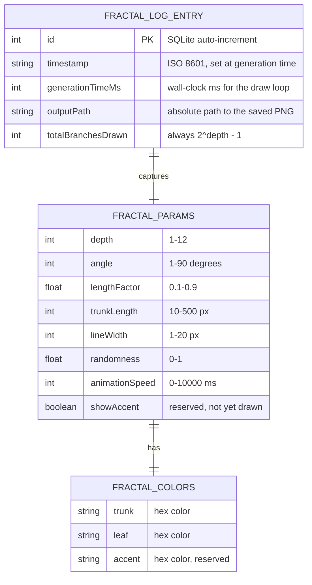
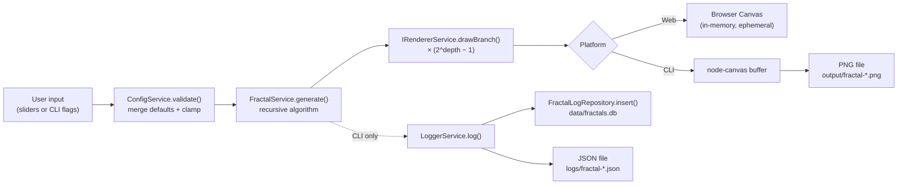

# Data Architecture

_[← README](../README.md) · [ARCHITECTURE](../ARCHITECTURE.md) · [CONTRACTS](./CONTRACTS.md) · [BUSINESS_CONTEXT](./BUSINESS_CONTEXT.md)_

This document covers what data the system holds, how it flows through the
system, where it's stored, and the retention/classification practices that
apply to it. Scope is intentionally small — this is a single-user,
no-account, no-backend application — but the same headings would apply if
it grew: get the habit right while the data model is simple.

## Data entities (logical model)



`RenderResult` and `CanvasConfig` (also in `core/domain/types.ts`) are
**transient** — return values used within a single `generate()` call and
never persisted, so they're intentionally left off the entity diagram
above.

## Physical schema (CLI only)

Only `FractalLogEntry` is actually persisted, and only by the CLI (the web
app has no server-side storage to persist to — see
[BUSINESS_CONTEXT.md](./BUSINESS_CONTEXT.md#system-context)). It's stored
in SQLite, denormalized: `FractalParams` (including its nested
`FractalColors`) is serialized to a single JSON `TEXT` column rather than
split into columns or a separate table.

```sql
CREATE TABLE IF NOT EXISTS fractal_logs (
  id                  INTEGER PRIMARY KEY AUTOINCREMENT,
  timestamp           TEXT    NOT NULL,
  params              TEXT    NOT NULL,  -- JSON-serialized FractalParams
  generation_time_ms  INTEGER,
  output_path         TEXT,
  total_branches      INTEGER
)
```

**Why denormalized is the right call here:** nothing in this application
queries _by_ an individual parameter (there's no "find all trees with
depth > 8" feature), so there's no query workload that would benefit from
normalized columns. If that changes, promoting frequently-queried fields
(e.g. `depth`) to real columns — while keeping the full params JSON as a
fallback — is the incremental path; it does not require a rewrite.

**Schema evolution:** the table is created with `CREATE TABLE IF NOT
EXISTS` and there is no migration framework. That's acceptable while the
schema has never changed, but it's a known gap: a future column addition
would need a real migration step (even a minimal `schema_version` table +
ordered `ALTER TABLE` scripts) rather than relying on `IF NOT EXISTS`,
which does nothing for an already-created table with an outdated shape.

## Data flow



Notes on this flow:

- The web path (`E -->|Web| F`) is a dead end by design: nothing about a
  web generation is ever persisted anywhere the application controls. A
  user who wants to keep a result has to explicitly click "Generate" and
  then rely on the browser's own download, which is outside this
  system's data flow entirely.
- The CLI path writes to **two** independent stores (SQLite and a JSON
  file) from one `log()` call. See
  [CONTRACTS.md#iloggerservice](./CONTRACTS.md#iloggerservice) for the
  ordering guarantee (and lack of a compensating transaction) between
  them.
- There is currently no reverse flow — nothing reads a past
  `FractalLogEntry` back into `ConfigService`/`FractalService` to
  reproduce it interactively. `npm run cli -- history` only _displays_
  past entries; re-running with the same parameters means manually
  copying the flags. A "replay" feature would need a new method on
  `IConfigService` or a small new port, not a change to the stored data
  shape.

## Data classification

| Data                                         | Classification             | Notes                                                                                                                                                                                                                                                           |
| -------------------------------------------- | -------------------------- | --------------------------------------------------------------------------------------------------------------------------------------------------------------------------------------------------------------------------------------------------------------- |
| `FractalParams` (depth, angle, colors, etc.) | Public / non-sensitive     | Purely aesthetic input; no PII, no secrets.                                                                                                                                                                                                                     |
| `FractalLogEntry.outputPath`                 | Local-environment metadata | Contains an absolute filesystem path, which can reveal a local username or directory layout (e.g. `/home/alice/...`). Not sensitive in the security sense, but avoid pasting raw log/DB contents into public issues or screenshots without checking this field. |
| Everything else in this system               | —                          | There is no user identity, no authentication, no analytics, no third-party data sharing. See [BUSINESS_CONTEXT.md](./BUSINESS_CONTEXT.md#system-context) for the full system boundary.                                                                          |

## Storage locations

| Data                | Location                                    | Committed to git?               |
| ------------------- | ------------------------------------------- | ------------------------------- |
| Web canvas render   | Browser memory only                         | N/A — never leaves the tab      |
| Web PNG download    | Wherever the user's browser saves downloads | N/A — outside the app's control |
| CLI PNG output      | `output/*.png`                              | No (`.gitignore`)               |
| CLI JSON log        | `logs/*.json`                               | No (`.gitignore`)               |
| CLI SQLite database | `data/fractals.db`                          | No (`.gitignore`)               |

`output/.gitkeep`, `logs/.gitkeep`, and `data/.gitkeep` are the only
tracked files in those directories — they exist purely so the directories
are present after a fresh clone, before the CLI has ever run.

## Retention & lifecycle (recommended practice, not yet implemented)

Today, nothing ever deletes old data: `output/`, `logs/`, and
`data/fractals.db` grow without bound as the CLI is used. For a
single-user local tool this is a minor concern, but it's called out here
explicitly as a known gap rather than a silent one:

- **Recommended:** add a `prune` CLI command (or a documented manual
  routine) that deletes `output/`/`logs/` files and `fractal_logs` rows
  older than a configurable age or beyond a configurable count.
- **Recommended:** if this project ever runs generation in a shared or
  server-side environment (not the case today — see the system context
  diagram), a retention policy stops being optional and needs to be in
  place before that deployment, not after.

## Practices applied here (and worth carrying forward)

- **One logical model, documented once** — the ER diagram above is the
  reference; don't let the SQLite schema, the TypeScript types, and this
  document drift independently. When one changes, update all three in
  the same change.
- **Classify data before storing it**, even when the answer is "this is
  non-sensitive" — the table above exists so that judgment is recorded,
  not re-derived from scratch every time someone asks "is it OK to share
  this log file?"
- **Note denormalization decisions and their trigger for revisiting**,
  rather than just doing it silently. The `fractal_logs.params` JSON
  column is a deliberate choice with a stated condition for when to
  reconsider it (see above), not an oversight.
- **Treat "no retention policy" as a tracked gap**, not an implicit
  decision. It's easy for unbounded local growth to go unnoticed until a
  disk-space problem forces the issue; naming it here means it's a
  conscious backlog item instead.
