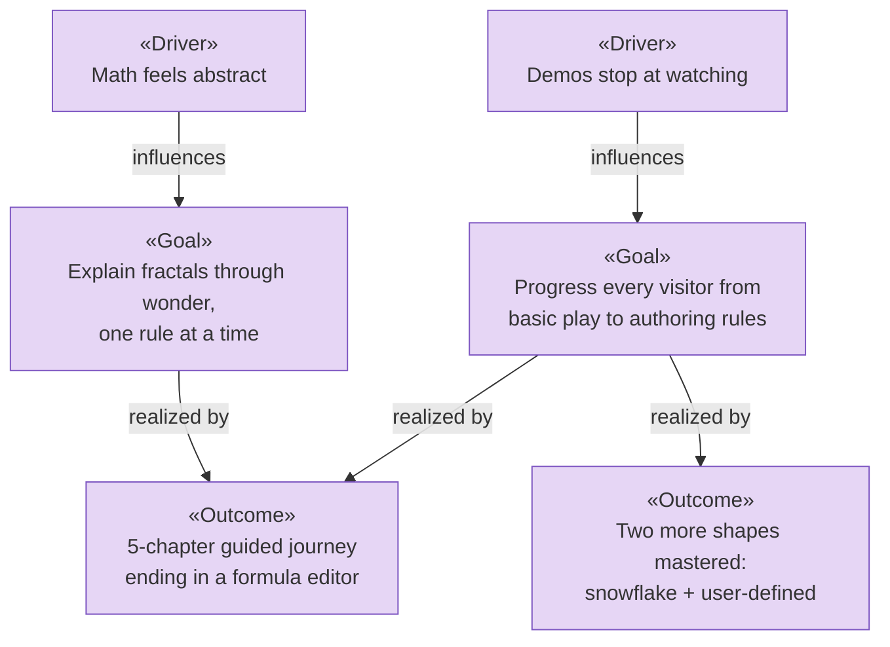

# Motivation — Stakeholders, Drivers, Goals, Principles

_[← Strategy layer](./README.md) · Source narrative: [domain context & rules](../2_business/5_domain-context-and-rules.md)_

**ArchiMate elements:** Stakeholder, Driver, Assessment, Goal, Outcome,
Principle.

## Stakeholders («Stakeholder»)

| Stakeholder                                          | Interest                                                                            |
| ---------------------------------------------------- | ----------------------------------------------------------------------------------- |
| **Curious learner** (child, student, casual visitor) | Understand why nature looks the way it does; play and create without prior math     |
| **Educator / parent**                                | A ready-made, bilingual, safe teaching journey from intuition to hands-on practice  |
| **Site owner / maintainer**                          | A polished, zero-cost showcase that is easy to extend (new chapters, new fractals)  |
| **Contributor / developer**                          | A clean, documented architecture that keeps the core platform-agnostic and testable |

## Drivers («Driver») and assessments («Assessment»)

| Driver                                                  | Assessment of the situation                                                                                                                |
| ------------------------------------------------------- | ------------------------------------------------------------------------------------------------------------------------------------------ |
| Math is widely perceived as abstract and unapproachable | Nature's beauty (trees, snowflakes, ferns) is a hook everyone already responds to — the gap is a bridge from "pretty" to "I can make this" |
| Learning tools stop at "watch"                          | Most fractal demos let you look or tweak, not **author**; authoring is where understanding sticks                                          |
| Multilingual reach                                      | The journey loses half its audience if it is English-only                                                                                  |
| Sustainability of a hobby project                       | Anything requiring a server or paid service will rot; the whole product must build to static files                                         |

## Goals («Goal») and outcomes («Outcome»)

| Goal                                                | Delivered outcome                                                                                                                               |
| --------------------------------------------------- | ----------------------------------------------------------------------------------------------------------------------------------------------- |
| Explain fractals through wonder, one rule at a time | Chapters 1–2 (story + didactic pages) kept intact; chapters 4–5 reuse their vocabulary ("stick", "rule", "self-call")                           |
| Progress visitors from basic play to authoring      | The journey now ends at `create.html`, where the visitor writes the rule — with the tree and snowflake available as loadable presets to dissect |
| Stay bilingual                                      | Every new string ships EN + ES; parser errors are machine codes translated at the edge                                                          |
| Stay free to operate                                | All new pages remain static; no backend added                                                                                                   |

## Principles («Principle»)

1. **One rule, many shapes** — every visual must be explainable as a small
   recursive rule; features that can't be taught that way don't belong.
2. **The core owns no platform** — business logic lives in `src/core/` and
   speaks only through ports ([interface contracts](../4_application/5_interface-contracts.md)); browsers and
   Node are adapters.
3. **Basic → advanced, never advanced-first** — new powers appear later in the
   journey and reuse earlier chapters' language (realized by the numbered
   route list in `src/adapters/web/routes.ts`).
4. **Safety before spectacle** — user-authored recursion must never freeze the
   tab (realized by the segment budget in `TurtleFractalService`).
5. **Bilingual by construction** — no user-facing string outside the i18n
   dictionary (`src/adapters/web/i18n.ts`).
