# Value Stream — From Wonder to Authorship

_[← Strategy layer](./README.md)_

**ArchiMate elements:** Value Stream, Value.

The studio delivers one end-to-end value stream: a visitor arrives curious and
leaves able to write a recursive rule of their own. Each stage adds value and
maps 1:1 to a journey chapter (a deliberate design decision — see
[Principle 3](./1_motivation.md#principles-principle)).

```mermaid
flowchart LR
  s1["«Value Stream Stage»<br>Wonder<br><i>Ch. 1 — Why?</i>"]:::strategy
  s2["«Value Stream Stage»<br>Understand<br><i>Ch. 2 — How?</i>"]:::strategy
  s3["«Value Stream Stage»<br>Create<br><i>Ch. 3 — Tree</i>"]:::strategy
  s4["«Value Stream Stage»<br>Craft<br><i>Ch. 4 — Snowflake</i>"]:::strategy
  s5["«Value Stream Stage»<br>Author<br><i>Ch. 5 — Your rule</i>"]:::strategy
  s6["«Value Stream Stage»<br>Behold<br><i>Ch. 6 — In 3D</i>"]:::strategy
  v["«Value»<br>Confidence that math<br>creates beauty — and<br>a PNG to prove it"]:::motivation

  s1 --> s2 --> s3 --> s4 --> s5 --> s6
  s6 -->|delivers| v

  classDef strategy fill:#f5deaa,stroke:#c8a24a,color:#333
  classDef motivation fill:#e6d6f5,stroke:#7e57c2,color:#333
```

| Stage          | Value added to the visitor                                                                                               | Enabled by                                   |
| -------------- | ------------------------------------------------------------------------------------------------------------------------ | -------------------------------------------- |
| **Wonder**     | Notices the shared pattern in trees, rivers, shells; wants to know why                                                   | `index.html` story + live wild-tree demo     |
| **Understand** | Grasps recursion: one rule, repeated; can predict 2ⁿ−1 growth                                                            | `learn.html` step cards, formula, playground |
| **Create**     | Produces a unique tree by steering ranges and wildness                                                                   | `generator.html` full tree panel             |
| **Craft**      | Transfers the idea to a new shape — six-fold symmetry, minimal chaos                                                     | `snowflake.html` dendrite generator          |
| **Author**     | Writes the rule itself: text formula or visual steps, from presets or scratch                                            | `create.html` DSL + rule builder + guide     |
| **Behold**     | Sees the rule escape the page: the same recursion, one more direction, fills space — and the tree can be orbited by hand | `tree3d.html` WebGL tree panel               |

**Cross-stage value:** at every creative stage (3–6) the visitor can export
their work as a PNG (the _Artwork_ business object) and switch language or
theme without losing progress.

The stages are served by the business services catalogued in
[business/2_business-services.md](../2_business/2_business-services.md).
