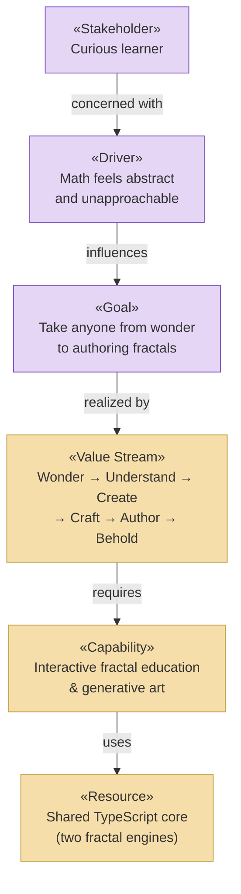

# Strategy & Motivation Layer

_[← EA home](../README.md)_

The top-down business context: who has a stake in Fractal Tree Studio, why it
exists, which capabilities it needs, and the value stream it delivers. This
layer motivates everything below it — each capability is realized by business
services in the [business layer](../2_business/README.md).

## Analysis order

Files are numbered in the order they are analyzed: first _who wants what
and why_, then _what we must be able to do_, and only then _how value flows_.

| #   | Document                                                             | Elements                                                        | Question it answers                                |
| --- | -------------------------------------------------------------------- | --------------------------------------------------------------- | -------------------------------------------------- |
| 1   | [1_motivation.md](./1_motivation.md)                                 | Stakeholders, Drivers, Assessments, Goals, Outcomes, Principles | Who cares, what pressures them, what must be true? |
| 2   | [2_capabilities-and-resources.md](./2_capabilities-and-resources.md) | Capabilities, Resources, Courses of Action                      | What must we be able to do, and with what?         |
| 3   | [3_value-stream.md](./3_value-stream.md)                             | Value Stream (Wonder → Author) and its chapter mapping          | How does value flow end-to-end?                    |

## Layer view

