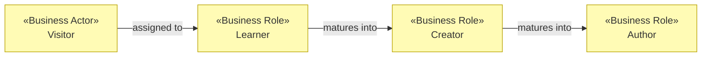

# Business Actors and Roles

_[← Business layer](./README.md)_

**ArchiMate elements:** Business Actor, Business Role.

## Actors («Business Actor»)

| Actor                 | Description                                                                                                     | Typical roles                  |
| --------------------- | --------------------------------------------------------------------------------------------------------------- | ------------------------------ |
| **Visitor**           | Anyone opening the site — child, student, adult with idle curiosity. Anonymous; no account exists or is planned | Learner, Creator               |
| **Educator / parent** | Uses the journey with or for someone else; values the linear chapter order and the ES translation               | Learner (vicariously), Curator |
| **Maintainer**        | The repository owner: evolves chapters, reviews PRs, operates releases                                          | Developer, Operator            |
| **GitHub** (external) | Third-party platform actor providing source hosting, CI execution and static hosting                            | Operator (automated)           |

## Roles («Business Role»)

| Role                          | Behavior                                                                                                 | Where it is exercised                                                                  |
| ----------------------------- | -------------------------------------------------------------------------------------------------------- | -------------------------------------------------------------------------------------- |
| **Learner**                   | Reads, watches step-by-step growth, plays with the didactic playground                                   | Chapters 1–2 (`index.html`, `learn.html`)                                              |
| **Creator**                   | Steers parameters, generates unique artwork, saves PNGs                                                  | Chapters 3–4 (`generator.html`, `snowflake.html`)                                      |
| **Author** (advanced Creator) | Writes or assembles fractal formulas; loads presets, reads the notation guide, interprets error messages | Chapter 5 (`create.html`)                                                              |
| **Curator**                   | Chooses language, shares links that preserve `?lang=`, restarts the journey                              | All pages (header controls, pagers)                                                    |
| **Developer / Operator**      | Maintains code, merges to `main`, which auto-deploys                                                     | Repository + CI/CD (see [technology/2_deployment.md](../5_technology/2_deployment.md)) |

## Role progression

The journey is designed so one actor flows through roles in order — the same
person is Learner first, Creator next, Author last:

This progression is exactly the [value stream](../1_strategy/3_value-stream.md);
the numbered navigation (`src/adapters/web/routes.ts`) is its concrete
realization.
