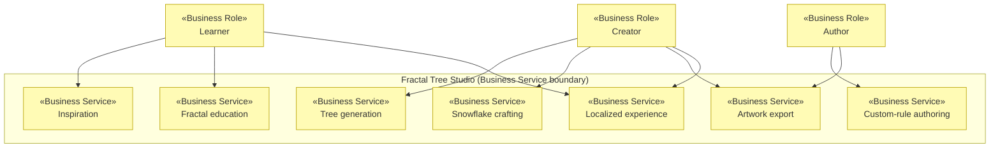

# Business Services

_[← Business layer](./README.md)_

**ArchiMate element:** Business Service — externally visible behavior offered
to the roles in [1_business-actors-and-roles.md](./1_business-actors-and-roles.md).

| Business service          | Offered to      | Description                                                                                                 | Realized by (application)                  | Page                |
| ------------------------- | --------------- | ----------------------------------------------------------------------------------------------------------- | ------------------------------------------ | ------------------- |
| **Inspiration**           | Learner         | Poses the "why is nature beautiful?" question with gallery, history (Mandelbrot) and a live math-drawn tree | Story page component                       | `index.html`        |
| **Fractal education**     | Learner         | Teaches the recursive rule step by step: rule cards, the formula, an interactive playground, tidy-vs-wild   | Learn page component                       | `learn.html`        |
| **Tree generation**       | Creator         | Grow unique fractal trees from ranged parameters and wildness                                               | Tree generation service (`FractalService`) | `generator.html`    |
| **Snowflake crafting**    | Creator         | Grow six-fold dendrite snow crystals from a simple panel with a pinch of "frost"                            | Snowflake service over the turtle engine   | `snowflake.html`    |
| **Custom-rule authoring** | Author          | Write fractal formulas (text DSL or visual steps), load known-fractal presets, learn the notation           | Formula toolchain + turtle engine          | `create.html`       |
| **Artwork export**        | Creator, Author | Save the current canvas as a PNG                                                                            | Renderer save (`WebRendererService.save`)  | All generator pages |
| **Localized experience**  | All roles       | Full EN/ES experience; language travels in shared links (`?lang=es`)                                        | i18n service                               | All pages           |
| **Headless generation**   | Developer       | Batch-generate tree PNGs with logged parameters from a terminal                                             | CLI component                              | `npm run cli`       |

## Service map

**Alignment notes**

- _Snowflake crafting_ is deliberately a **simpler** service than _Tree
  generation_: single-value sliders instead of ranges, because real crystals
  need almost no chaos (business rule realized by `SnowflakeParams` clamp
  ranges, jitter capped at 15%).
- _Custom-rule authoring_ embeds its own enablement content (the "How to
  write a formula" guide) rather than pushing users back to chapter 2 — the
  service must be self-sufficient for visitors arriving via deep link.
- All services except _Headless generation_ are delivered through the same
  static web channel; none require a backend (see
  [Principle 4/zero-cost driver](../1_strategy/1_motivation.md)).
