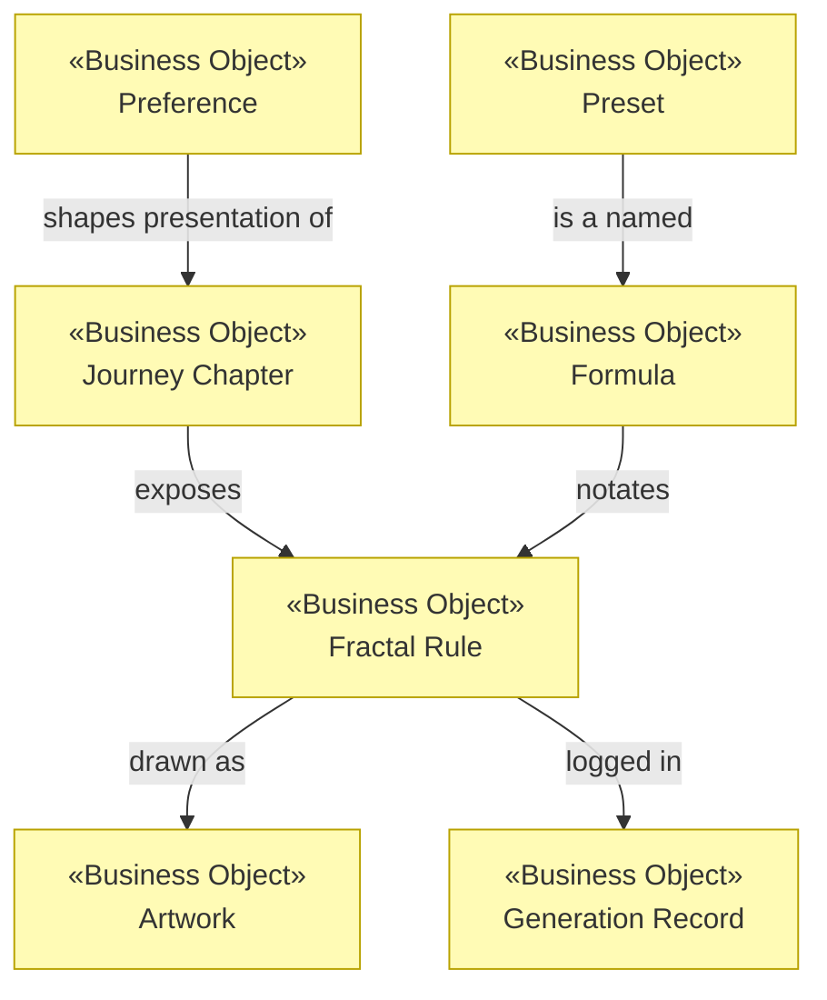

# Business Objects

_[← Business layer](./README.md)_

**ArchiMate element:** Business Object — the concepts the business talks
about, independent of how software stores them. Their digital counterparts
are in [information/1_data-objects.md](../3_information/1_data-objects.md).

| Business object       | Meaning                                                                                                                                                                                            | Handled by                | Represented as (information layer)                                                     |
| --------------------- | -------------------------------------------------------------------------------------------------------------------------------------------------------------------------------------------------- | ------------------------- | -------------------------------------------------------------------------------------- |
| **Journey Chapter**   | One numbered stage of the guided experience, with a title, a badge and a place in the sequence                                                                                                     | Guided journey process    | `Route` entries in `routes.ts`                                                         |
| **Fractal Rule**      | The recursive recipe that grows a shape — "draw a stick, branch, do it all again smaller"                                                                                                          | All creative services     | `FractalParams` (tree), `TurtleProgram` (snowflake & custom), `Tree3DParams` (3D tree) |
| **Formula**           | A Fractal Rule written down in the studio's notation, readable and shareable as text                                                                                                               | Custom-rule authoring     | DSL text ↔ `TurtleProgram` AST                                                         |
| **Preset**            | A named, known Fractal Rule offered as a starting point (tree, snowflake, fern, crystal, spiral, bush); the **fern** loads first so chapter 5 opens with a shape the visitor has not already grown | Custom-rule authoring     | `PRESETS` list + `DEFAULT_PRESET_ID` in `create.ts`                                    |
| **Artwork**           | A finished, exportable picture the visitor made                                                                                                                                                    | Artwork export            | Canvas raster → PNG file                                                               |
| **Preference**        | The visitor's chosen language and theme                                                                                                                                                            | Localized experience      | `localStorage` keys + `?lang=` URL parameter                                           |
| **Generation Record** | The memory of one headless generation: parameters used, outcome, output file                                                                                                                       | Headless generation (CLI) | `FractalLogEntry` (SQLite + JSON)                                                      |

## Object relationships

**Alignment note:** the pivotal object of the initiative is **Formula** — it
did not exist in the baseline plateau. Making the Fractal Rule _writable_
(not just tunable) is what turns Creators into Authors, and everything in
chapter 5 (builder, presets, guide, error messages) exists to serve that one
object.
