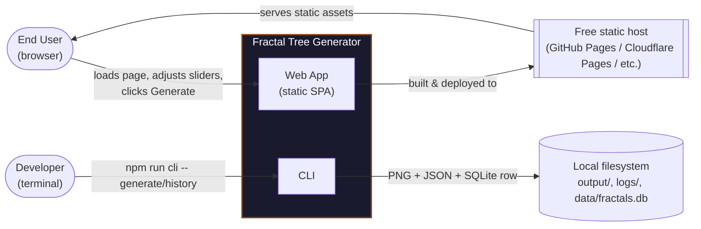

# Domain Context & Business Rules

_[← Business layer](./README.md) · [EA home](../README.md)_

Technical documentation ([solution design](../4_application/4_solution-design.md),
[interface contracts](../4_application/5_interface-contracts.md)) describes _how_ the system is built. This
document describes _why_ — the problem being solved, the system boundary,
the vocabulary the code should use consistently, and the reasoning behind
the business rules encoded in `ConfigService`. Keeping this alongside the
technical docs is a deliberate practice: a constraint like "depth is capped
at 12" reads as an arbitrary magic number until you know it exists to stop
a runaway recursion from freezing the user's browser tab.

## Problem statement

Generative/recursive art (L-systems, fractal trees) is a well-known way to
demonstrate recursion and parametric design, but most simple demos are
either static images or throwaway scripts with no way to reproduce a
result, share it, or run it unattended. This project provides:

1. An interactive, zero-install web experience — anyone with a browser can
   explore the parameter space and get an image, with no account, no
   backend, and no cost to run (static hosting).
2. A scriptable CLI for the same algorithm, so specific parameter sets can
   be reproduced, batch-generated, or logged for later comparison —
   something the web mode intentionally doesn't need, since a browser tab
   has no durable storage of its own to log to.

## Actors / stakeholders

Who the system serves is documented once, not repeated here: stakeholders
and their motivations live in
[1_strategy/1_motivation.md](../1_strategy/1_motivation.md), and the
business actors/roles that interact with the delivered product in
[1_business-actors-and-roles.md](./1_business-actors-and-roles.md).

There is no administrator, no multi-tenant concept, and no authentication —
the system context is intentionally this small (see the diagram below).

## System context

Notably absent: no third-party API calls, no authentication provider, no
server-side compute, no analytics/tracking. That's a deliberate scope
boundary, not an oversight — it's what makes "publish for free with zero
ongoing cost" possible, and it means there's no user data to protect beyond
what a developer chooses to keep in their own local `data/fractals.db`
(see [data architecture](../3_information/3_data-architecture.md#data-classification)).

## Bounded context

Everything in this repository is a single bounded context: **Fractal
Generation**. `FractalParams` is that context's one aggregate — there is no
separate "user," "project," or "gallery" concept today. If the product grew
to include, say, saved galleries or shareable links, that would likely
become its own bounded context (with its own persistence and its own
identity model) rather than being bolted onto `FractalParams` — keeping the
drawing algorithm's parameters free of concerns like ownership or
visibility that have nothing to do with how a tree is drawn.

## Domain glossary (ubiquitous language)

Use these terms consistently in code, commit messages, and issues — they
should mean the same thing everywhere.

| Term                    | Meaning                                                                                                                        |
| ----------------------- | ------------------------------------------------------------------------------------------------------------------------------ |
| **Fractal Tree**        | The complete branching structure produced by one generation.                                                                   |
| **Generation**          | One end-to-end run of the algorithm: validate params → draw → (CLI only) persist + log.                                        |
| **Branch**              | A single straight line segment; the atomic drawing unit. A tree with depth _n_ has exactly 2ⁿ − 1 branches.                    |
| **Trunk**               | The first branch drawn (depth = max), starting at canvas bottom-center pointing straight up.                                   |
| **Depth**               | How many branching generations occur below the trunk. Depth 1 = trunk only, no children.                                       |
| **Leaf zone**           | Branches at depth ≤ 2, rendered in the leaf color instead of the trunk color, to visually separate "twigs" from "wood."        |
| **Branch angle**        | The angle (degrees) each child branch diverges from its parent's direction, applied symmetrically left and right.              |
| **Length factor**       | The multiplier applied to branch length at each generation; child branches are always shorter than their parent by this ratio. |
| **Jitter / randomness** | A normalized `0–1` factor that perturbs angle and length slightly so trees look organic rather than perfectly symmetric.       |
| **Render target**       | The surface a generation is drawn onto: the browser's `<canvas>`, or an in-memory `node-canvas` buffer written to a PNG.       |
| **Speed control**       | The artificial per-branch delay used to animate the web canvas or slow down CLI output for demonstration purposes.             |

## Business rules and their rationale

Every numeric constraint in `ConfigService`'s `CONSTRAINTS` table exists for
a concrete product reason, not an arbitrary one. Documenting the _why_
here means a future change to these numbers is a deliberate product
decision, not a guess:

| Field            | Range      | Why this range                                                                                                                                                                                                                                           |
| ---------------- | ---------- | -------------------------------------------------------------------------------------------------------------------------------------------------------------------------------------------------------------------------------------------------------- |
| `depth`          | 1–12       | A full tree has 2ᵈᵉᵖᵗʰ − 1 branches. At depth 12 that's 4,095 branches — already a lot to animate. Uncapped depth risks freezing the browser tab (synchronous recursion budget) or making the CLI take unreasonably long.                                |
| `angle`          | 1–90°      | At 0°, child branches perfectly overlap their parent (visually a single line, not a fork). Above 90°, branches start folding back toward the trunk, no longer reading as a natural tree shape.                                                           |
| `lengthFactor`   | 0.1–0.9    | Must be `< 1` so each generation's branches are strictly shorter than their parent — this is what makes it a _converging_ fractal instead of one that grows without bound. Below `0.1`, child branches become visually imperceptible almost immediately. |
| `trunkLength`    | 10–500px   | Bounded to fit inside the fixed 800×600 render surface without the trunk alone running off-canvas.                                                                                                                                                       |
| `lineWidth`      | 1–20px     | Below 1px branches may not render visibly on all displays; above 20px thick branches obscure the tree's fine structure.                                                                                                                                  |
| `randomness`     | 0–1        | Expressed as a normalized proportion (0 = perfectly symmetric, 1 = maximum jitter) so it composes predictably with angle and length regardless of their own ranges.                                                                                      |
| `animationSpeed` | 0–10,000ms | `0` means instant (no artificial delay). The 10-second upper bound keeps even a slow, fully-animated deep tree from taking an unreasonable amount of wall-clock time to finish drawing.                                                                  |

These constraints are enforced in exactly one place
(`ConfigService.validate`, see [interface contracts](../4_application/5_interface-contracts.md#iconfigservice))
so the web UI, the CLI, and any future adapter all get the same guarantees
without re-implementing the rule.

## Practices for keeping business context attached to the code

- **One glossary, reused everywhere.** Class/interface/variable names in
  `core/` should match the terms in this glossary (`FractalService`,
  `depth`, `lengthFactor`, ...) rather than inventing synonyms per layer.
- **Constraints carry a comment or doc reference, not just a number.** A
  bare `{ min: 1, max: 12 }` is a trap for the next person; link back to
  this document (as the table above does) whenever the _reason_ for a
  limit isn't obvious from the code alone.
- **New business rules get a row in the table above before they get a
  line of code.** If a change can't be explained as a row in that table,
  that's a signal it might be a technical constraint dressed up as a
  business one (or vice versa) and deserves a second look.
- **Bounded context stays small on purpose.** Resist adding
  user-management, sharing, or storage concerns directly to
  `FractalParams`/`FractalService`; grow them as a new context with its
  own contracts instead (see [solution design](../4_application/4_solution-design.md#adding-a-new-platform-eg-a-nativeelectron-renderer)
  for the equivalent guidance on the technical side).
