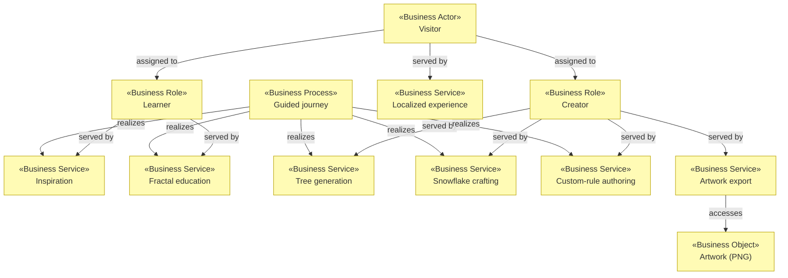

# Business Layer

_[← EA home](../README.md)_

Who interacts with Fractal Tree Studio, the services it offers them, the
processes those services run through, and the business objects they handle.

## Analysis order

Files are numbered in the order they are analyzed: identify _who_ first,
then _what they are offered_, then _how it is delivered_, then _what is
handled_, and finally the domain vocabulary and rules that constrain all of
it.

| #   | Document                                                           | Elements                                           | Question it answers                              |
| --- | ------------------------------------------------------------------ | -------------------------------------------------- | ------------------------------------------------ |
| 1   | [1_business-actors-and-roles.md](./1_business-actors-and-roles.md) | Business Actors and Roles                          | Who interacts with the studio?                   |
| 2   | [2_business-services.md](./2_business-services.md)                 | Business Services                                  | What is offered to them?                         |
| 3   | [3_business-processes.md](./3_business-processes.md)               | Business Processes                                 | How are those services delivered?                |
| 4   | [4_business-objects.md](./4_business-objects.md)                   | Business Objects                                   | What things do the processes handle?             |
| 5   | [5_domain-context-and-rules.md](./5_domain-context-and-rules.md)   | Problem statement, system context, glossary, rules | What vocabulary and constraints bind everything? |

## Layer view

Every business service is realized by application services — the mapping is in
[application/1_application-services.md](../4_application/1_application-services.md).
