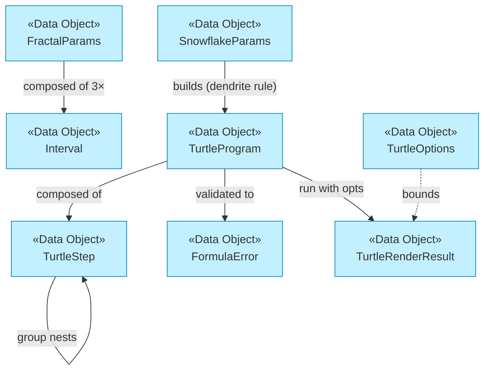

# Data Objects

_[← Information layer](./README.md)_

**ArchiMate element:** Data Object — the digital representations of the
[business objects](../2_business/4_business-objects.md). All core types are plain,
platform-free TypeScript (no DOM, no Node APIs), which is what lets both the
browser and the CLI share them.

## Fractal rules

| Data object                    | Defined in                     | Represents                             | Key fields                                                                                                                                                   |
| ------------------------------ | ------------------------------ | -------------------------------------- | ------------------------------------------------------------------------------------------------------------------------------------------------------------ |
| `FractalParams`                | `src/core/domain/types.ts`     | The tree's Fractal Rule                | `depth`/`angle`/`lengthFactor` as **`Interval`** ranges sampled per branch, `trunkLength`, `lineWidth`, `colors`, `randomness` (wildness), animation timings |
| `Interval`                     | `src/core/domain/types.ts`     | A closed numeric range                 | `min`, `max`; wildness decides where samples land                                                                                                            |
| `TurtleProgram` / `TurtleStep` | `src/core/domain/turtle.ts`    | A user-authorable Fractal Rule as data | steps: `draw`, `move`, `turn`, `group` (bracketed side trip), `recurse` (self-call, max 5 per program)                                                       |
| `TurtleOptions`                | `src/core/domain/turtle.ts`    | How to run a program                   | `depth`, `symmetry` (1–12 rotated copies), `baseLength`, `jitter`, `origin`, colors, `maxSegments` budget                                                    |
| `SnowflakeParams`              | `src/core/domain/snowflake.ts` | The snowflake's friendly knobs         | `depth`, `branchAngle`, `sideScale`, `spineScale`, `size`, `jitter` ("frost"), colors                                                                        |

## Outcomes and diagnostics

| Data object          | Defined in                               | Represents                                                                                                                   |
| -------------------- | ---------------------------------------- | ---------------------------------------------------------------------------------------------------------------------------- |
| `RenderResult`       | `src/core/domain/types.ts`               | Outcome of a tree generation: branches drawn, elapsed ms                                                                     |
| `TurtleRenderResult` | `src/core/domain/turtle.ts`              | Outcome of a turtle run: segments drawn, **`truncated`** flag (budget hit), elapsed ms                                       |
| `FormulaError`       | `src/core/application/turtle/formula.ts` | One formula problem: machine `code`, character `position`+`length`, optional `detail` — never prose (translated at the edge) |
| `FractalLogEntry`    | `src/core/domain/types.ts`               | A CLI Generation Record: timestamp, full params, timing, output path                                                         |

## Edge data (adapters only)

| Data                        | Kept in                                              | Notes                                                             |
| --------------------------- | ---------------------------------------------------- | ----------------------------------------------------------------- |
| i18n dictionary             | `src/adapters/web/i18n.ts`                           | ~200 keys × {en, es}; `{param}` placeholders substituted by `t()` |
| Route list                  | `src/adapters/web/routes.ts`                         | The Journey Chapter catalog: file, nav/pager/chapter keys         |
| Preset catalog              | `src/adapters/web/create.ts`                         | Six named formulas with suggested depth/symmetry/origin/size      |
| Theme + language preference | browser `localStorage` (`ftree-theme`, `ftree-lang`) | Language additionally mirrored in the URL                         |

## Type relationships

**Alignment invariant:** `parseFormula(serializeFormula(p))` deep-equals `p`
for every valid program (unit-tested) — the property that keeps the text and
visual representations of a Formula from drifting apart.
