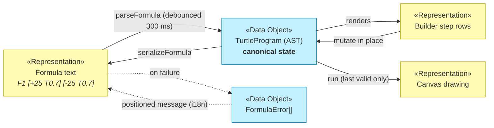
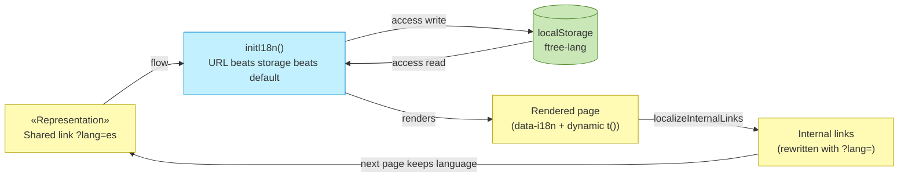
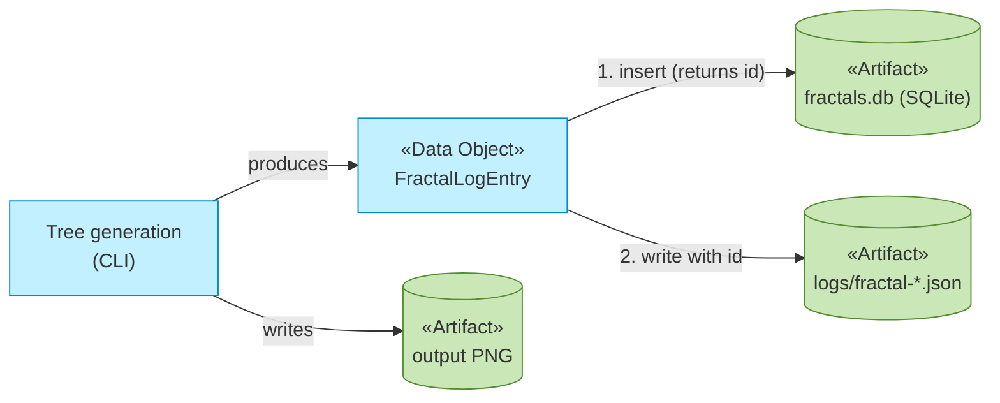

# Data Flows and Persistence

_[← Information layer](./README.md)_

**ArchiMate elements:** Representation, Flow, Access relationships.

## Where information lives

The studio is a static site: **no server-side state exists**. Everything the
visitor produces or configures lives in one of four places:

| Store                                           | Contents                    | Lifetime                        |
| ----------------------------------------------- | --------------------------- | ------------------------------- |
| URL query (`?lang=es`)                          | Language choice             | As long as the link is shared   |
| Browser `localStorage`                          | `ftree-theme`, `ftree-lang` | Until cleared by the user       |
| Canvas (in-memory raster)                       | The current Artwork         | Until regenerate/clear/navigate |
| Downloaded PNG                                  | Exported Artwork            | User's filesystem               |
| SQLite `fractals.db` + `logs/*.json` (CLI only) | Generation Records          | Local machine                   |

## Flow 1 — Formula, in and out of its representations

The same Fractal Rule exists as three synchronized representations on the
create page. The AST is canonical; the others are projections.

Invariants: invalid text is **never rewritten**; the canvas always shows the
**last valid** program; round-trip parse∘serialize ≡ identity.

## Flow 2 — Language preference

## Flow 3 — CLI generation record (write-twice)

The CLI logs each generation to SQLite **then** to a JSON file (with the
SQLite id merged in). The dual write and its divergence risk are contracted
in [interface contracts](../4_application/5_interface-contracts.md) and analyzed in
[data architecture](./3_data-architecture.md).

## Data classification

All data is either **public content** (the site itself) or **user-local**
(preferences, artwork, CLI logs). No personal data is collected, transmitted
or stored remotely; there are no cookies, analytics or accounts. This is a
deliberate consequence of the zero-cost/no-backend driver in
[strategy/1_motivation.md](../1_strategy/1_motivation.md).
