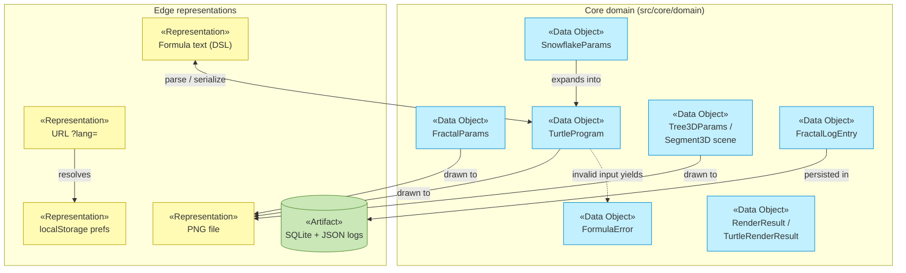

# Information Layer

_[← EA home](../README.md)_

The passive structure of the architecture: the data objects that represent
the [business objects](../2_business/4_business-objects.md), and how information
flows and persists.

## Analysis order

Files are numbered in the order they are analyzed: first _what information
exists_, then _how it moves and is represented_, and finally _how it is
physically stored, classified, and retained_.

| #   | Document                                           | Elements                                             | Question it answers                                |
| --- | -------------------------------------------------- | ---------------------------------------------------- | -------------------------------------------------- |
| 1   | [1_data-objects.md](./1_data-objects.md)           | Data Objects (domain types) and their code locations | What information exists?                           |
| 2   | [2_data-flows.md](./2_data-flows.md)               | Representations, persistence and flow relationships  | How does it move between representations?          |
| 3   | [3_data-architecture.md](./3_data-architecture.md) | ER model, physical schema, classification, retention | Where does it live, how sensitive is it, how long? |

## Layer view

