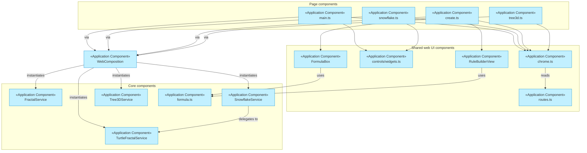

# Application Components

_[← Application layer](./README.md)_

**ArchiMate element:** Application Component — structural units of software,
each mapped to its real source location so this document stays verifiable.

## Page entry points (one per journey chapter)

| Component           | Chapter       | Source                                             | Composes                                                 |
| ------------------- | ------------- | -------------------------------------------------- | -------------------------------------------------------- |
| Story page          | 1 — Why?      | `src/adapters/web/story.ts` + `index.html`         | `composeWebServices`                                     |
| Learn page          | 2 — How?      | `src/adapters/web/learn.ts` + `learn.html`         | `composeWebServices` ×8 (one per demo canvas)            |
| Tree generator page | 3 — Create!   | `src/adapters/web/main.ts` + `generator.html`      | `composeWebServices`, `ControlsView`                     |
| Snowflake page      | 4 — Snowflake | `src/adapters/web/snowflake.ts` + `snowflake.html` | `composeSnowflakeServices`, `SnowflakeControls`          |
| Create page         | 5 — Your rule | `src/adapters/web/create.ts` + `create.html`       | `composeTurtleServices`, `FormulaBox`, `RuleBuilderView` |
| 3D tree page        | 6 — The leap  | `src/adapters/web/tree3d.ts` + `tree3d.html`       | `composeTree3DServices`, `Tree3DControls`                |

## Core application components (platform-free, `src/core/`)

| Component              | Source                                     | Responsibility                                                                          |
| ---------------------- | ------------------------------------------ | --------------------------------------------------------------------------------------- |
| `FractalService`       | `core/application/FractalService.ts`       | Recursive two-child tree algorithm                                                      |
| `TurtleFractalService` | `core/application/TurtleFractalService.ts` | Generic turtle-program interpreter with symmetry, jitter, segment budget                |
| `SnowflakeService`     | `core/application/SnowflakeService.ts`     | Façade: `SnowflakeParams` → dendrite `TurtleProgram`                                    |
| `Tree3DService`        | `core/application/Tree3DService.ts`        | Breadth-first 3D tree builder: `Tree3DParams` → `Segment3D` scene, segment budget       |
| Formula toolchain      | `core/application/turtle/formula.ts`       | `parseFormula`, `serializeFormula`, `validateProgram`, `estimateSegments`, `insertStep` |
| `ConfigService`        | `core/application/ConfigService.ts`        | Tree defaults + clamping                                                                |
| `SpeedControlService`  | `core/application/SpeedControlService.ts`  | Animation delay                                                                         |
| `math.ts`              | `core/application/math.ts`                 | `sampleInterval`, `clamp`, color helpers                                                |

## Adapter components

| Component                                | Source                                       | Realizes                                                                                        |
| ---------------------------------------- | -------------------------------------------- | ----------------------------------------------------------------------------------------------- |
| `WebRendererService`                     | `adapters/web/WebRendererService.ts`         | `IRendererService` via Canvas2D, animated strokes, PNG download                                 |
| `NodeCanvasRendererService`              | `adapters/node/NodeCanvasRendererService.ts` | `IRendererService` via `node-canvas`, PNG file write                                            |
| `WebGLTreeRendererService`               | `adapters/web/WebGLTreeRendererService.ts`   | `ITree3DRendererService` via raw WebGL: orbit/zoom camera, staggered growth, spin, PNG download |
| `FractalLogRepository` / `LoggerService` | `adapters/node/*.ts`                         | `IFractalLogRepository` / `ILoggerService` (SQLite + JSON)                                      |

## Shared web UI components

| Component                        | Source                                        | Used by                                                        |
| -------------------------------- | --------------------------------------------- | -------------------------------------------------------------- |
| `routes.ts`                      | `adapters/web/routes.ts`                      | `chrome.ts` (single source of the chapter list)                |
| `chrome.ts`                      | `adapters/web/chrome.ts`                      | Every page (header, badge, pager, theme/lang wiring)           |
| `i18n.ts`                        | `adapters/web/i18n.ts`                        | Every page                                                     |
| `theme.ts`                       | `adapters/web/theme.ts`                       | Every page                                                     |
| `serialRunner.ts`                | `adapters/web/serialRunner.ts`                | `main.ts`, `story.ts`, `learn.ts`, `snowflake.ts`, `create.ts` |
| `controls/widgets.ts`            | `adapters/web/controls/widgets.ts`            | `ControlsView.ts`, `SnowflakeControls.ts`, `create.ts`         |
| `ControlsView.ts`                | `adapters/web/ControlsView.ts`                | Tree page                                                      |
| `SnowflakeControls.ts`           | `adapters/web/SnowflakeControls.ts`           | Snowflake page                                                 |
| `Tree3DControls.ts`              | `adapters/web/Tree3DControls.ts`              | 3D tree page                                                   |
| `rulebuilder/FormulaBox.ts`      | `adapters/web/rulebuilder/FormulaBox.ts`      | Create page (text half of sync)                                |
| `rulebuilder/RuleBuilderView.ts` | `adapters/web/rulebuilder/RuleBuilderView.ts` | Create page (visual half of sync)                              |

## Composition roots and CLI

| Component            | Source                           | Responsibility                                                                                                                    |
| -------------------- | -------------------------------- | --------------------------------------------------------------------------------------------------------------------------------- |
| `WebComposition.ts`  | `composition/WebComposition.ts`  | `composeWebServices`, `composeTurtleServices`, `composeSnowflakeServices`, `composeTree3DServices` — one service graph per canvas |
| `NodeComposition.ts` | `composition/NodeComposition.ts` | Wires `FractalService` to Node adapters for the CLI                                                                               |
| `cli.ts`             | `src/cli.ts`                     | `generate` / `history` commands                                                                                                   |

## Component diagram

