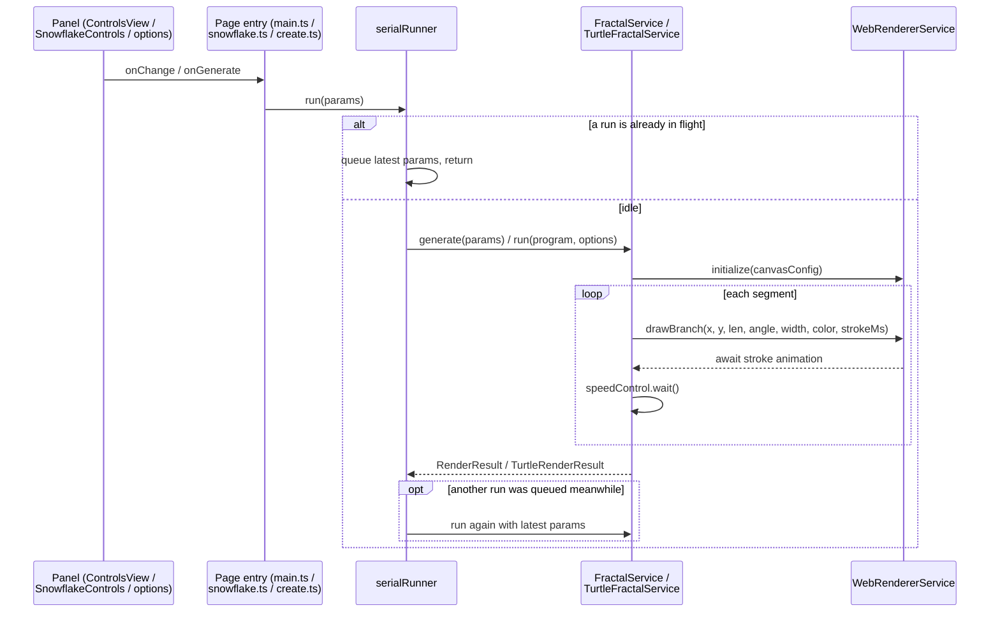
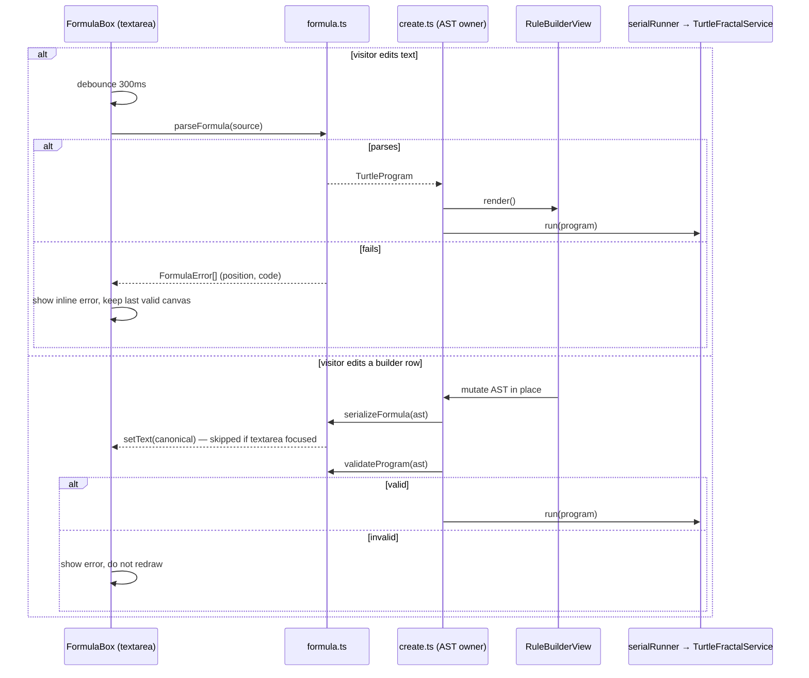
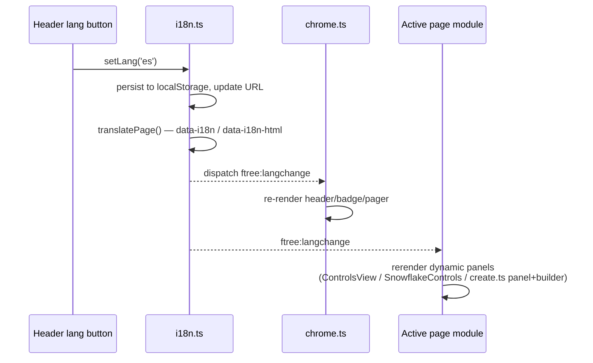

# Application Collaborations

_[← Application layer](./README.md)_

**ArchiMate elements:** Application Collaboration, Application Interaction.
Key runtime sequences that show components cooperating to realize an
application service.

## C1 — Generate (tree, snowflake, or custom fractal)

The same serialize-and-run pattern is shared by all three generator pages via
`serialRunner.ts`, so it is documented once.

Realizes: Tree generation, Snowflake crafting, Custom-rule authoring
(drawing step). Contract: `IFractalService.generate` /
`ITurtleFractalService.run` in [interface contracts](../4_application/5_interface-contracts.md).

The 3D tree page (`tree3d.ts`) deliberately does **not** use the serial
runner: `Tree3DService.generate` builds the whole `Segment3D` scene
synchronously and `presentScene` replaces the displayed scene atomically,
so overlapping calls cannot interleave strokes the way the per-segment 2D
engines can. Camera motion (orbit/zoom/spin) happens entirely inside
`WebGLTreeRendererService` without re-entering the core.

## C2 — Two-way formula sync (chapter 5 authoring loop)

Realizes: Custom-rule authoring. Invariant:
`parseFormula(serializeFormula(p)) ≡ p` (unit-tested), which is what prevents
the two representations from oscillating.

## C3 — Language switch

Realizes: Localized experience. Every dynamically-built panel listens for
`ftree:langchange` so no page requires a reload to switch language.
