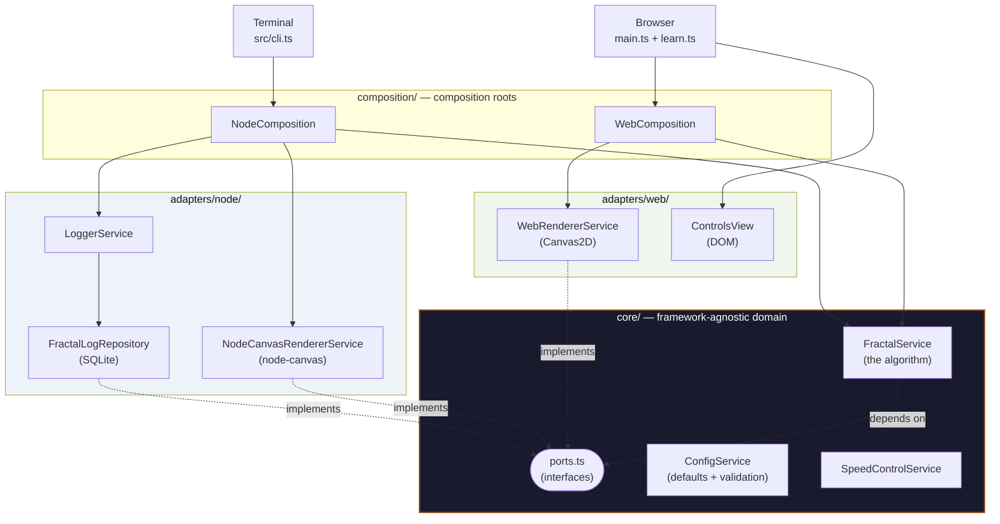
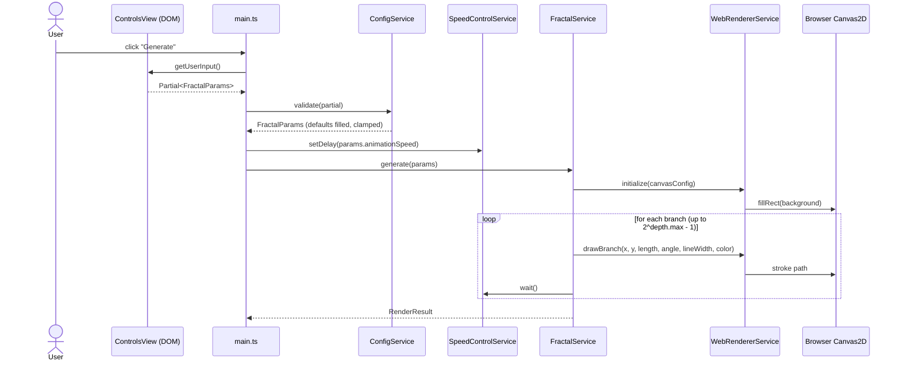
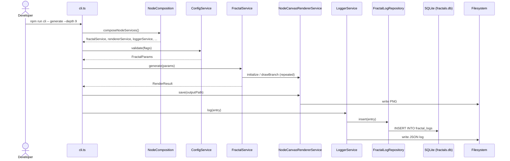

# Solution Design

_[← Application layer](./README.md) · [EA home](../README.md)_

This project follows a **Ports & Adapters (Hexagonal) Architecture**. The
goal: the fractal-drawing algorithm and its business rules exist in exactly
one place, and every platform-specific concern (browser Canvas, Node's
`node-canvas`, SQLite, the CLI) plugs into that core through interfaces —
never the other way around.

**Related documentation:**

- [interface contracts](../4_application/5_interface-contracts.md) — the interface contracts referenced below (pre/postconditions, invariants, error behavior)
- [domain context & rules](../2_business/5_domain-context-and-rules.md) — why this exists, who it's for, domain glossary, business rules
- [data architecture](../3_information/3_data-architecture.md) — data entities, storage, lifecycle

## Solution overview

The system has three pieces of business logic: the classic recursive tree
algorithm (`FractalService`), a generic turtle-program interpreter
(`TurtleFractalService`) that executes data-driven fractal rules — the
snowflake page runs a fixed dendrite rule on it (via the `SnowflakeService`
façade) and the create-your-own page runs user-written formulas parsed by
`turtle/formula.ts` — and a 3D tree builder (`Tree3DService`) that grows
the branching rule in space as platform-free `Segment3D` geometry. The 2D
engines draw through the same `IRendererService` segment primitive, so the
browser UI and the headless CLI stay thin adapters; the 3D engine hands
its finished scene to the `ITree3DRendererService` port, whose WebGL
adapter owns camera and interaction. Nothing about drawing algorithms,
validation rules, or animation timing is duplicated between platforms; the
only things that differ are _how a segment gets drawn_ (Canvas2D vs.
`node-canvas` vs. WebGL) and _what happens to the result_ (stays on screen
vs. gets written to disk + logged).

## Project structure

```
pages/                           # HTML entry points (Vite root) — index, learn,
│                                # generator, snowflake, create, tree3d
src/
├── core/                        # Framework-agnostic domain + business logic
│   ├── domain/types.ts          # Value types: FractalParams, CanvasConfig, ...
│   ├── domain/turtle.ts         # Turtle engine types: TurtleProgram, TurtleStep, ...
│   ├── domain/snowflake.ts      # SnowflakeParams
│   ├── domain/tree3d.ts         # 3D chapter types: Tree3DParams, Segment3D, Vec3, ...
│   ├── ports.ts                 # Interfaces the core depends on (never concretes)
│   └── application/
│       ├── FractalService.ts    # The recursive tree algorithm (chapters 1–3)
│       ├── TurtleFractalService.ts  # Generic turtle-program interpreter (chapters 4–5)
│       ├── SnowflakeService.ts  # Dendrite-crystal façade over the turtle engine
│       ├── Tree3DService.ts     # Breadth-first 3D tree builder (chapter 6)
│       ├── turtle/formula.ts    # Formula DSL: parser, serializer, validator, estimator
│       ├── ConfigService.ts     # Tree defaults + validation/clamping
│       ├── SpeedControlService.ts
│       └── math.ts              # Pure numeric helpers
├── adapters/                    # Platform-specific implementations of the ports
│   ├── web/
│   │   ├── WebRendererService.ts   # Implements IRendererService via Canvas2D
│   │   ├── WebGLTreeRendererService.ts # Implements ITree3DRendererService via raw WebGL
│   │   ├── routes.ts               # The journey's route list; nav/badges/pagers derive from it
│   │   ├── chrome.ts               # Shared header/badge/pager rendering + theme/lang wiring
│   │   ├── serialRunner.ts         # Serializes generate() runs (latest queued params win)
│   │   ├── controls/widgets.ts     # Reusable slider/color/action-row widgets
│   │   ├── ControlsView.ts         # Tree panel (interval sliders + widgets)
│   │   ├── SnowflakeControls.ts    # Simpler snowflake panel (widgets only)
│   │   ├── Tree3DControls.ts       # 3D tree panel (widgets + spin toggle)
│   │   ├── rulebuilder/            # FormulaBox (text) + RuleBuilderView (visual), two-way synced
│   │   ├── main.ts                 # Entry: generator page (chapter 3)
│   │   ├── story.ts / learn.ts     # Entries: chapters 1–2
│   │   ├── snowflake.ts / create.ts # Entries: chapters 4–5
│   │   └── tree3d.ts               # Entry: 3D tree page (chapter 6)
│   └── node/
│       ├── NodeCanvasRendererService.ts  # Implements IRendererService via node-canvas
│       ├── FractalLogRepository.ts       # Implements IFractalLogRepository via SQLite
│       └── LoggerService.ts
├── composition/                 # Composition roots — the only place adapters are wired together
│   ├── WebComposition.ts        # composeWebServices / composeTurtleServices / composeSnowflakeServices / composeTree3DServices
│   └── NodeComposition.ts       # Used by cli.ts only
└── cli.ts                       # Node CLI entry point

tests/core/                      # Vitest unit tests for core/application/*
docs/ea/                         # Enterprise architecture (this document set)
docs/scope/                      # One scope document per delivered initiative
```

## Component diagram



The `core` box has no outgoing arrows to `adapters` — that's the whole
point of the pattern. Dependencies point inward, toward the domain.

## Class diagram — ports and their implementers

```mermaid
classDiagram
    class IFractalService {
        <<interface>>
        +generate(params) Promise~RenderResult~
        +clear() void
    }
    class IRendererService {
        <<interface>>
        +initialize(config) void
        +drawBranch(x, y, length, angle, lineWidth, color, strokeMs) void
        +save(outputPath) Promise~void~
        +clear() void
    }
    class IConfigService {
        <<interface>>
        +getDefaults() FractalParams
        +validate(params) FractalParams
    }
    class ISpeedControlService {
        <<interface>>
        +setDelay(ms) void
        +getDelay() number
        +wait() Promise~void~
        +isEnabled() boolean
    }
    class ILoggerService {
        <<interface>>
        +log(entry) Promise~void~
        +getRecent(limit) Promise~FractalLogEntry[]~
    }
    class IFractalLogRepository {
        <<interface>>
        +insert(entry) number
        +findRecent(limit) FractalLogEntry[]
        +findById(id) FractalLogEntry
    }

    class FractalService {
        -branchCount : number
    }
    class ConfigService
    class SpeedControlService
    class WebRendererService
    class NodeCanvasRendererService
    class LoggerService
    class FractalLogRepository

    FractalService ..|> IFractalService
    ConfigService ..|> IConfigService
    SpeedControlService ..|> ISpeedControlService
    WebRendererService ..|> IRendererService
    NodeCanvasRendererService ..|> IRendererService
    LoggerService ..|> ILoggerService
    FractalLogRepository ..|> IFractalLogRepository

    FractalService --> IRendererService : uses
    FractalService --> ISpeedControlService : uses
    FractalService --> IConfigService : uses
    LoggerService --> IFractalLogRepository : uses
```



Full contract details (pre/postconditions, invariants, error behavior) for
each interface live in [interface contracts](../4_application/5_interface-contracts.md).

## Sequence diagram — web "Generate" flow



## Sequence diagram — CLI `generate` flow



## Why two composition roots instead of one factory

An earlier version of this codebase had a single `ServiceFactory` that
branched on `mode: 'cli' | 'web'`, but statically imported **both**
`NodeCanvasRendererService` (which pulls in the native `node-canvas` addon)
and `WebRendererService` at the top of the same file. Because ES module
imports are resolved statically, that meant every web build's module graph
included the Node-only native dependency — bloating (or breaking) the
browser bundle even though it was never used at runtime.

Splitting into `WebComposition.ts` and `NodeComposition.ts` means each entry
point's module graph only ever contains the adapters it actually needs.
`adapters/web/main.ts` never has a static or dynamic path to `node-canvas`
or `better-sqlite3`. This is verified by the production build: the browser
bundle is ~5.5KB regardless of the CLI's dependencies.

## Patterns in use

- **Ports & Adapters (Hexagonal Architecture)** — `core/` depends only on
  the interfaces in `core/ports.ts`; `adapters/` provides the concrete
  implementations. Swapping the renderer (browser vs. headless PNG) requires
  no change to `FractalService`.
- **Dependency Injection (constructor injection)** — `FractalService` takes
  its renderer, speed control, and config service as constructor arguments.
  It's fully unit-testable with fakes/spies (see `tests/core/`).
- **Strategy Pattern** — `IRendererService` has two interchangeable
  strategies (`WebRendererService`, `NodeCanvasRendererService`) selected by
  which composition root is used.
- **Repository Pattern** — `FractalLogRepository` isolates SQLite access
  behind `IFractalLogRepository`. It's CLI-only and never referenced from
  the web composition root.
- **Composition Root** — `WebComposition.ts` / `NodeComposition.ts` are the
  only files that `new` up concrete adapter classes. Nothing else in the
  codebase should instantiate an adapter directly.
- **Single Responsibility** — `ControlsView.ts` only touches the DOM
  (reading slider values, building the control panel). It has no knowledge
  of the fractal-drawing algorithm; that logic lives once, in
  `FractalService`.

## Language choice

TypeScript (strict mode) for both the browser bundle and the Node CLI —
one language, one type system, across the whole stack, with first-class
typings for both the Canvas2D/DOM APIs and Node's `fs`/`path`. It compiles
to plain static assets for the web target, which is what free static hosts
(GitHub Pages, Cloudflare Pages, Vercel, Netlify) expect.

## Tooling

| Concern          | Tool                                                                                                                      |
| ---------------- | ------------------------------------------------------------------------------------------------------------------------- |
| Build            | Vite 6                                                                                                                    |
| Styling          | Tailwind CSS 3 (via PostCSS)                                                                                              |
| CLI framework    | commander                                                                                                                 |
| Node persistence | better-sqlite3 (CLI-only)                                                                                                 |
| Tests            | Vitest, unit-testing `core/application/*` in isolation                                                                    |
| Lint             | ESLint (`typescript-eslint` flat config)                                                                                  |
| Format           | Prettier                                                                                                                  |
| Pre-commit       | husky + lint-staged                                                                                                       |
| CI               | GitHub Actions (`.github/workflows/ci.yml`) — lint, typecheck, test, build                                                |
| Deploy           | GitHub Actions (`.github/workflows/deploy.yml`) — builds `dist/web` and publishes to GitHub Pages on every push to `main` |

## Adding a new platform (e.g. a native/Electron renderer)

1. Implement `IRendererService` (and any other ports you need) in a new
   `adapters/<platform>/` directory.
2. Add a `compose<Platform>Services()` function in `composition/` that wires
   the new adapter together with the existing `core/application` services.
   Do not add a branch to an existing composition root — each entry point
   gets its own, so unrelated platforms' native dependencies never end up
   in each other's module graphs.
3. Add a thin entry point that calls your new composition function.
4. Document the new port/adapter pair in [interface contracts](../4_application/5_interface-contracts.md).
