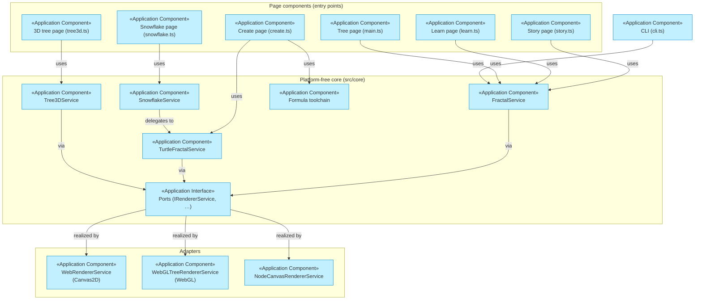

# Application Layer

_[← EA home](../README.md)_

The software that realizes the [business services](../2_business/2_business-services.md):
application services, the components providing them, how the components
collaborate, and — at the finest grain — the class-level solution design and
the contracts of every port.

## Analysis order

Files are numbered in the order they are analyzed, from the coarsest view
(services offered to the business) down to the finest (per-method interface
contracts).

| #   | Document                                                             | Elements                                                    | Question it answers                              |
| --- | -------------------------------------------------------------------- | ----------------------------------------------------------- | ------------------------------------------------ |
| 1   | [1_application-services.md](./1_application-services.md)             | Application Services and the business services they realize | What does the software offer the business layer? |
| 2   | [2_application-components.md](./2_application-components.md)         | Application Components, mapped to source files              | Which components provide those services?         |
| 3   | [3_application-collaborations.md](./3_application-collaborations.md) | Collaborations and interaction sequences                    | How do the components interact?                  |
| 4   | [4_solution-design.md](./4_solution-design.md)                       | Ports & adapters design, diagrams, patterns, tooling        | How is the code structured, and why?             |
| 5   | [5_interface-contracts.md](./5_interface-contracts.md)               | Per-port pre/postconditions, invariants, error behavior     | What exactly does each interface promise?        |

## Layer view (ports-and-adapters)

Composition roots (`src/composition/WebComposition.ts`,
`NodeComposition.ts`) are the only places concrete adapters are wired to the
core — one service graph per canvas.
