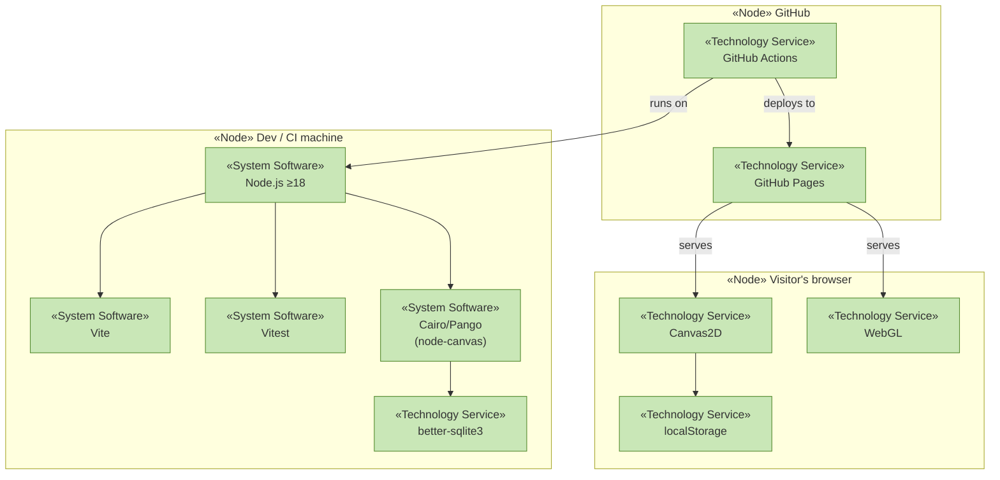

# Technology Services

_[← Technology layer](./README.md)_

**ArchiMate elements:** Technology Service, Node, System Software.

## Runtime services

| Technology service           | Provided by                                                             | Serves                                                                            |
| ---------------------------- | ----------------------------------------------------------------------- | --------------------------------------------------------------------------------- |
| **2D rendering**             | Browser Canvas2D API                                                    | `WebRendererService` — draws every segment, animates strokes, exports PNG         |
| **3D rendering**             | Browser WebGL API                                                       | `WebGLTreeRendererService` — draws the chapter-6 scene, orbit camera, exports PNG |
| **2D rendering (headless)**  | `node-canvas` (Cairo/Pango/libjpeg/libgif/librsvg via system libraries) | `NodeCanvasRendererService` — CLI PNG output                                      |
| **JS/TS execution**          | Browser JS engine                                                       | All page components                                                               |
| **Server-side JS execution** | Node.js ≥ 18                                                            | CLI, build tooling                                                                |
| **Local key-value storage**  | Browser `localStorage`                                                  | Theme + language preference persistence                                           |
| **Relational storage**       | `better-sqlite3` (embedded, synchronous)                                | CLI `FractalLogRepository`                                                        |

## Build & quality-gate services

| Technology service         | Provided by                             | Serves                                             |
| -------------------------- | --------------------------------------- | -------------------------------------------------- |
| **Bundling & dev server**  | Vite 6                                  | `npm run dev`, `npm run build` → static `dist/web` |
| **Utility-first styling**  | Tailwind CSS 3 + PostCSS + Autoprefixer | `src/assets/styles.css`                            |
| **Type checking**          | TypeScript (strict mode)                | `npm run typecheck`, editor feedback               |
| **Unit testing**           | Vitest                                  | `tests/core/**` (68 tests)                         |
| **Linting / formatting**   | ESLint 9 (flat config) + Prettier       | `npm run lint`, `npm run format`                   |
| **Pre-commit enforcement** | Husky + lint-staged                     | Auto-fix staged files before commit                |

## Hosting & automation services

| Technology service             | Provided by                                   | Serves                                                         |
| ------------------------------ | --------------------------------------------- | -------------------------------------------------------------- |
| **Source control & PR review** | GitHub                                        | Branch `claude/snowflake-custom-fractals-8nuutc` → PR → `main` |
| **CI pipeline**                | GitHub Actions (`.github/workflows/ci.yml`)   | lint → typecheck → test → build, on every push/PR              |
| **Static hosting**             | GitHub Pages (`.github/workflows/deploy.yml`) | Serves `dist/web` on push to `main`                            |

## Technology stack diagram

