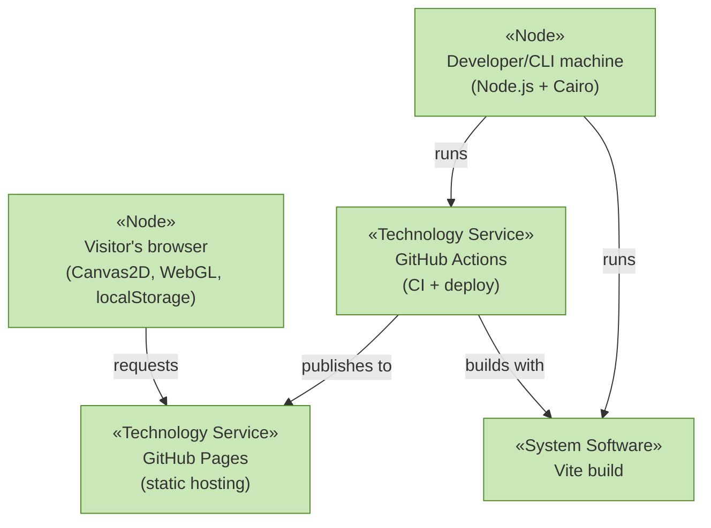

# Technology Layer

_[← EA home](../README.md)_

The runtimes, tooling and infrastructure that the [application
layer](../4_application/README.md) executes on.

## Analysis order

Files are numbered in the order they are analyzed: first _which technology
services exist and what provides them_, then _how the built artifacts reach
their runtime nodes_.

| #   | Document                                               | Elements                                                         | Question it answers                      |
| --- | ------------------------------------------------------ | ---------------------------------------------------------------- | ---------------------------------------- |
| 1   | [1_technology-services.md](./1_technology-services.md) | Technology Services and the nodes/system software providing them | What infrastructure services are used?   |
| 2   | [2_deployment.md](./2_deployment.md)                   | Nodes, Artifacts, and the CI/CD deployment pipeline              | How does the build get to where it runs? |

## Layer view

