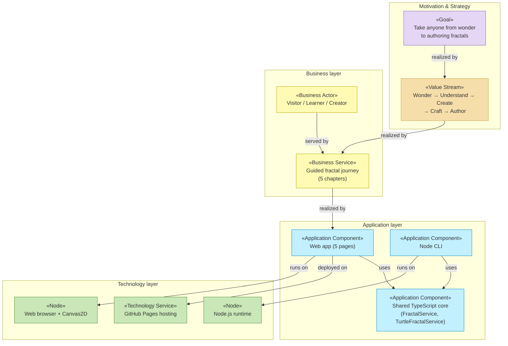

# Enterprise Architecture — Fractal Tree Studio

_[← README](../../README.md) · [ARCHITECTURE](../../ARCHITECTURE.md) · [CONTRACTS](../CONTRACTS.md) · [BUSINESS_CONTEXT](../BUSINESS_CONTEXT.md) · [DATA_ARCHITECTURE](../DATA_ARCHITECTURE.md)_

This folder documents Fractal Tree Studio as an **ArchiMate-layered enterprise
architecture**: strategy and business context top-down, then the business,
information, application, and technology layers, and — separately — the scope
of the delivered initiative. Every element is grounded in the implemented
solution: entries name the page, module, or pipeline file that realizes them,
so the architecture can be verified against the code at any time.

## How to navigate

| Document                                | ArchiMate viewpoint        | Answers                                                                       |
| --------------------------------------- | -------------------------- | ----------------------------------------------------------------------------- |
| [project-scope.md](./project-scope.md)  | Implementation & Migration | What was this initiative? Work packages, deliverables, plateaus, gaps         |
| [strategy/](./strategy/README.md)       | Motivation + Strategy      | Why does this exist? Who cares? What capabilities and value stream?           |
| [business/](./business/README.md)       | Business layer             | Who does what? Which services does the studio offer, through which processes? |
| [information/](./information/README.md) | Passive structure (data)   | What information exists, where does it live, how does it flow?                |
| [application/](./application/README.md) | Application layer          | Which software services and components realize the business services?         |
| [technology/](./technology/README.md)   | Technology layer           | What runs it all — runtimes, tooling, build, hosting, deployment?             |

## Notation conventions

ArchiMate has no native Mermaid profile, so these documents encode ArchiMate
semantics onto Mermaid flowcharts with two rules:

1. **Element type as a «stereotype»** in the first line of each node label,
   e.g. `«Business Service»`, `«Application Component»`.
2. **Layer color** via a `classDef` per layer, approximating the standard
   ArchiMate palette:

| Layer                      | class            | Fill             |
| -------------------------- | ---------------- | ---------------- |
| Motivation                 | `motivation`     | violet `#e6d6f5` |
| Strategy                   | `strategy`       | sand `#f5deaa`   |
| Business                   | `business`       | yellow `#fffbb5` |
| Application                | `application`    | cyan `#c2f0ff`   |
| Technology                 | `technology`     | green `#c9e7b7`  |
| Implementation & Migration | `implementation` | rose `#ffd6d6`   |

Relationships are labeled with their ArchiMate name: **serves**, **realizes**,
**assigned to**, **accesses**, **triggers**, **flow**, **aggregates**,
**influences**. Where Mermaid arrowheads can't distinguish relation types, the
label is authoritative.

## Layered overview

## Reading order

Top-down (recommended for newcomers): [strategy/motivation.md](./strategy/motivation.md)
→ [strategy/value-stream.md](./strategy/value-stream.md) →
[business/business-services.md](./business/business-services.md) →
[application/application-components.md](./application/application-components.md)
→ [technology/deployment.md](./technology/deployment.md).

Bottom-up (for developers verifying alignment): start from
[application/application-components.md](./application/application-components.md),
which links each component to its source file, then trace upward via the
"realizes" relationships.
