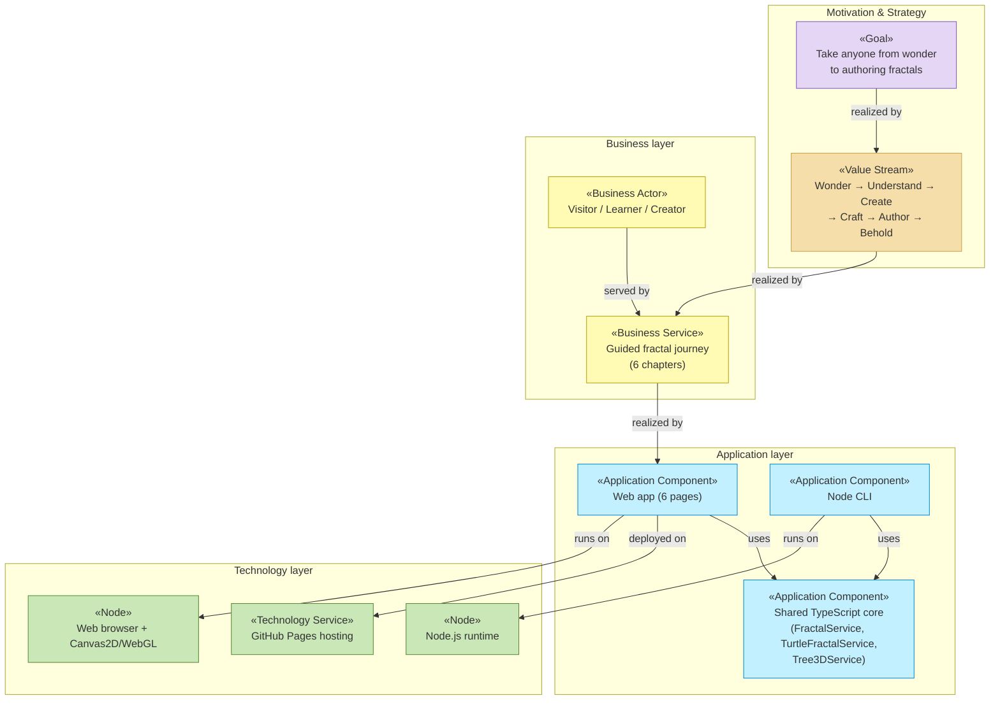

# Enterprise Architecture — Fractal Tree Studio

_[← Repository README](../../README.md) · [Scope documents](../scope/README.md)_

This folder is the **primary documentation of the system**, organized as an
ArchiMate-layered enterprise architecture. Every element is grounded in the
implemented solution: entries name the page, module, or pipeline file that
realizes them, so the architecture can be verified against the code at any
time.

Folders and files carry a numeric prefix giving the order in which they are
assessed. **Any change in requirements is aligned through these layers in
this order — strategy first, technology last — and captured in a
[scope document](../scope/README.md) before implementation starts** (see
[CONTRIBUTING.md](../../CONTRIBUTING.md) and the `ea-first-change` skill in
`.claude/skills/`).

## Layers, in assessment order

| #   | Layer                                       | ArchiMate viewpoint      | Answers                                                                       |
| --- | ------------------------------------------- | ------------------------ | ----------------------------------------------------------------------------- |
| 1   | [1_strategy/](./1_strategy/README.md)       | Motivation + Strategy    | Why does this exist? Who cares? What capabilities and value stream?           |
| 2   | [2_business/](./2_business/README.md)       | Business layer           | Who does what? Which services does the studio offer, through which processes? |
| 3   | [3_information/](./3_information/README.md) | Passive structure (data) | What information exists, where does it live, how does it flow?                |
| 4   | [4_application/](./4_application/README.md) | Application layer        | Which software services and components realize the business services?         |
| 5   | [5_technology/](./5_technology/README.md)   | Technology layer         | What runs it all — runtimes, tooling, build, hosting, deployment?             |

Files inside each layer folder are numbered the same way; each layer README
explains its own analysis order. Delivered initiatives (ArchiMate
Implementation & Migration viewpoint) are documented per initiative in
[../scope/](../scope/README.md), not here — the EA describes the **current**
state, scope documents describe the **changes** that produced it.

## Notation conventions

ArchiMate has no native Mermaid profile, so these documents encode ArchiMate
semantics onto Mermaid flowcharts with two rules:

1. **Element type as a «stereotype»** in the first line of each node label,
   e.g. `«Business Service»`, `«Application Component»`.
2. **Layer color** via a `classDef` per layer, approximating the standard
   ArchiMate palette:

| Layer                      | class            | Fill             |
| -------------------------- | ---------------- | ---------------- |
| Motivation                 | `motivation`     | violet `#e6d6f5` |
| Strategy                   | `strategy`       | sand `#f5deaa`   |
| Business                   | `business`       | yellow `#fffbb5` |
| Application                | `application`    | cyan `#c2f0ff`   |
| Technology                 | `technology`     | green `#c9e7b7`  |
| Implementation & Migration | `implementation` | rose `#ffd6d6`   |

Relationships are labeled with their ArchiMate name: **serves**, **realizes**,
**assigned to**, **accesses**, **triggers**, **flow**, **aggregates**,
**influences**. Where Mermaid arrowheads can't distinguish relation types, the
label is authoritative.

## Layered overview

## Reading order

Top-down (recommended for newcomers — the same order as the folder numbers):
[1_strategy/1_motivation.md](./1_strategy/1_motivation.md)
→ [1_strategy/3_value-stream.md](./1_strategy/3_value-stream.md)
→ [2_business/2_business-services.md](./2_business/2_business-services.md)
→ [3_information/1_data-objects.md](./3_information/1_data-objects.md)
→ [4_application/2_application-components.md](./4_application/2_application-components.md)
→ [5_technology/2_deployment.md](./5_technology/2_deployment.md).

Bottom-up (for developers verifying alignment): start from
[4_application/2_application-components.md](./4_application/2_application-components.md),
which links each component to its source file, then trace upward via the
"realizes" relationships.
