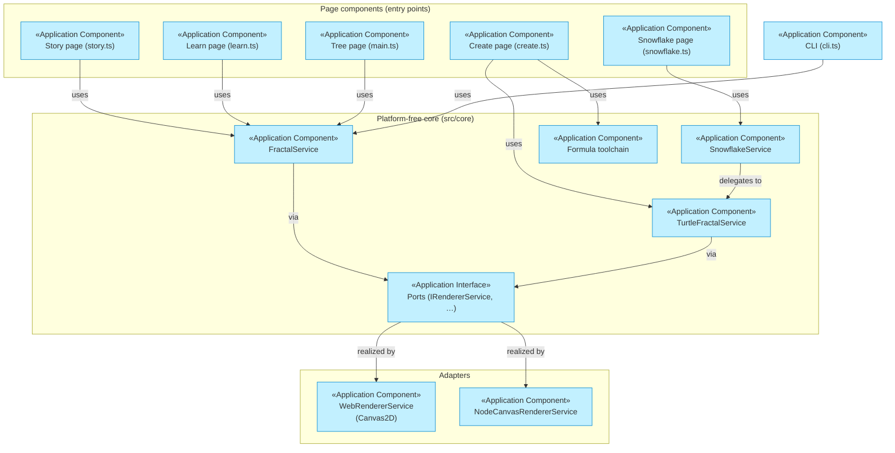

# Application Layer

_[← EA home](../README.md)_

The software that realizes the [business services](../business/business-services.md):
application services, the components providing them, and how the components
collaborate. The class-level design is in
[ARCHITECTURE.md](../../../ARCHITECTURE.md); port contracts in
[CONTRACTS.md](../../CONTRACTS.md).

| Document                                                         | Elements                                                    |
| ---------------------------------------------------------------- | ----------------------------------------------------------- |
| [application-services.md](./application-services.md)             | Application Services and the business services they realize |
| [application-components.md](./application-components.md)         | Application Components, mapped to source files              |
| [application-collaborations.md](./application-collaborations.md) | Collaborations and interaction sequences                    |

## Layer view (ports-and-adapters)

Composition roots (`src/composition/WebComposition.ts`,
`NodeComposition.ts`) are the only places concrete adapters are wired to the
core — one service graph per canvas.
