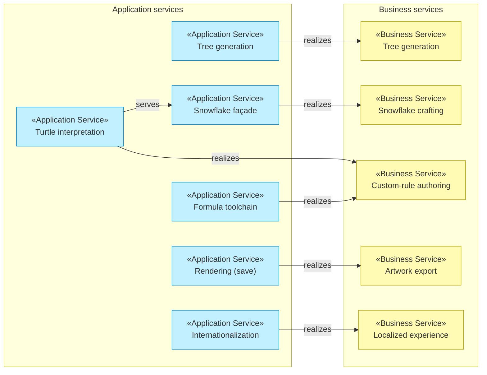

# Application Services

_[← Application layer](../application/README.md)_

**ArchiMate element:** Application Service — units of application behavior,
each realizing (part of) a [business service](../business/business-services.md).

## Fractal engines

| Application service                                                                                                                              | Realizes (business)                               | Provided by                                    | Contract                                                |
| ------------------------------------------------------------------------------------------------------------------------------------------------ | ------------------------------------------------- | ---------------------------------------------- | ------------------------------------------------------- |
| **Tree generation** — recursive two-child tree with per-branch interval sampling and wildness                                                    | Tree generation; also powers all learn-page demos | `src/core/application/FractalService.ts`       | `IFractalService` in [CONTRACTS.md](../../CONTRACTS.md) |
| **Turtle interpretation** — executes data-driven rules (draw/move/turn/branch/self-call) with n-fold symmetry, jitter, and a hard segment budget | Snowflake crafting, Custom-rule authoring         | `src/core/application/TurtleFractalService.ts` | `ITurtleFractalService`                                 |
| **Snowflake façade** — friendly knobs → fixed dendrite program at symmetry 6                                                                     | Snowflake crafting                                | `src/core/application/SnowflakeService.ts`     | `ISnowflakeService`                                     |

## Formula toolchain

| Application service       | Behavior                                                                                                    | Provided by                                                |
| ------------------------- | ----------------------------------------------------------------------------------------------------------- | ---------------------------------------------------------- |
| **Formula parsing**       | DSL text → `TurtleProgram`, with positioned machine-coded errors                                            | `parseFormula` in `src/core/application/turtle/formula.ts` |
| **Formula serialization** | AST → canonical text (round-trip safe)                                                                      | `serializeFormula`                                         |
| **Program validation**    | Semantic rules: ≤ 5 self-calls, ≥ 1 draw, scales/turns in range, nesting ≤ 4                                | `validateProgram`                                          |
| **Segment estimation**    | Closed-form upper bound `D·(Bᵈ−1)/(B−1)·symmetry`, used for the live "≈ N sticks" readout and trim warnings | `estimateSegments`                                         |

## Supporting services

| Application service      | Behavior                                                                           | Provided by                                                              |
| ------------------------ | ---------------------------------------------------------------------------------- | ------------------------------------------------------------------------ |
| **Parameter validation** | Tree defaults + clamping; idempotent                                               | `ConfigService.ts`                                                       |
| **Speed control**        | Configurable delay between segments (watch-it-grow animation)                      | `SpeedControlService.ts`                                                 |
| **Rendering**            | Draw one segment; save PNG; clear                                                  | `WebRendererService.ts` (browser) / `NodeCanvasRendererService.ts` (CLI) |
| **Serial-run guard**     | Serializes overlapping generate calls; latest queued params win                    | `serialRunner.ts`                                                        |
| **Navigation chrome**    | Header, chapter badge, pager rendered from the route list                          | `chrome.ts` + `routes.ts`                                                |
| **Internationalization** | Dictionary lookup with `{param}` substitution; page translation; link localization | `i18n.ts`                                                                |
| **Theming**              | Dark/light with pre-paint flash guard; canvas background sync                      | `theme.ts`                                                               |
| **Control panels**       | Spec-driven parameter UIs from shared widgets                                      | `ControlsView.ts`, `SnowflakeControls.ts`, `controls/widgets.ts`         |
| **Rule building UI**     | Visual step editing + text box, two-way synced                                     | `rulebuilder/RuleBuilderView.ts`, `rulebuilder/FormulaBox.ts`            |

## Realization map (business ← application)

