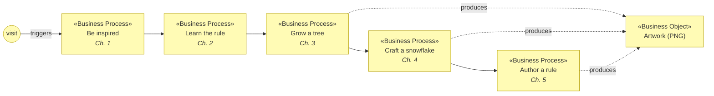
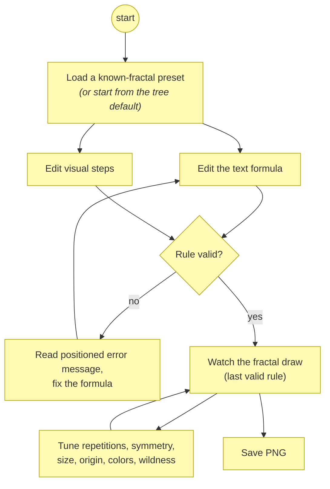
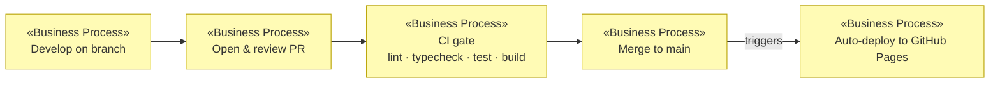

# Business Processes

_[← Business layer](./README.md)_

**ArchiMate element:** Business Process — sequences of behavior that realize
the [business services](./business-services.md).

## P1 — Guided journey (the flagship process)

The visitor-facing process realizing the whole
[value stream](../strategy/value-stream.md). Linear by design; every page
offers prev/next pagers and a numbered header so visitors always know where
they are.

## P2 — Create-a-fractal (chapter 5 inner loop)

The authoring process inside chapter 5. Two entry paths (text or visual)
converge on one canonical rule; drawing never blocks on an invalid rule.

Realized by the two-way sync collaboration documented in
[application/application-collaborations.md](../application/application-collaborations.md).

## P3 — Localization

| Step                | Behavior                                                                                                                 |
| ------------------- | ------------------------------------------------------------------------------------------------------------------------ |
| Language resolution | URL `?lang=` beats stored preference beats English default                                                               |
| Switching           | Header EN/ES buttons re-render every page fragment (static via `data-i18n`, dynamic via re-render on `ftree:langchange`) |
| Propagation         | Internal links are rewritten so the language survives navigation and shared URLs                                         |

Realized by `src/adapters/web/i18n.ts` + `chrome.ts`; the rule "no
user-facing string outside the dictionary" is
[Principle 5](../strategy/motivation.md#principles-principle).

## P4 — Release

The maintainer-facing process; fully automated after merge.

Technology realization: [technology/deployment.md](../technology/deployment.md).
