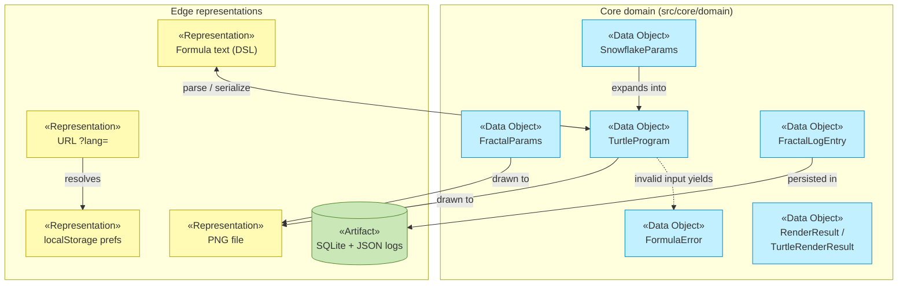

# Information Layer

_[← EA home](../README.md)_

The passive structure of the architecture: the data objects that represent
the [business objects](../business/business-objects.md), and how information
flows and persists. Complements the entity-level detail in
[DATA_ARCHITECTURE.md](../../DATA_ARCHITECTURE.md).

| Document                             | Elements                                             |
| ------------------------------------ | ---------------------------------------------------- |
| [data-objects.md](./data-objects.md) | Data Objects (domain types) and their code locations |
| [data-flows.md](./data-flows.md)     | Representations, persistence and flow relationships  |

## Layer view

