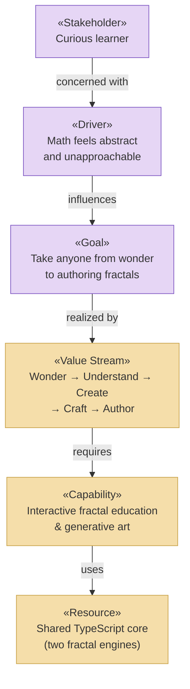

# Strategy & Motivation Layer

_[← EA home](../README.md)_

The top-down business context: who has a stake in Fractal Tree Studio, why it
exists, which capabilities it needs, and the value stream it delivers. This
layer motivates everything below it — each capability is realized by business
services in the [business layer](../business/README.md).

| Document                                                         | Elements                                                        |
| ---------------------------------------------------------------- | --------------------------------------------------------------- |
| [motivation.md](./motivation.md)                                 | Stakeholders, Drivers, Assessments, Goals, Outcomes, Principles |
| [capabilities-and-resources.md](./capabilities-and-resources.md) | Capabilities, Resources, Courses of Action                      |
| [value-stream.md](./value-stream.md)                             | The Wonder → Author value stream and its chapter mapping        |

## Layer view

