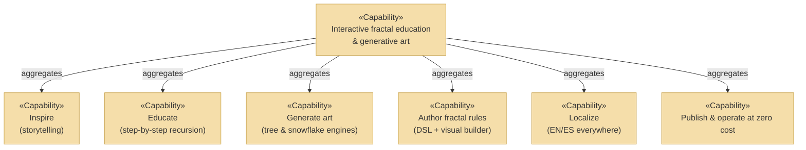

# Capabilities, Resources, Courses of Action

_[← Strategy layer](./README.md)_

**ArchiMate elements:** Capability, Resource, Course of Action.

## Capability map («Capability»)

| Capability           | Realized by (business layer)                                  | Anchored in code                                         |
| -------------------- | ------------------------------------------------------------- | -------------------------------------------------------- |
| Inspire              | [Inspiration service](../business/business-services.md)       | `index.html`, `story.ts`                                 |
| Educate              | [Fractal education service](../business/business-services.md) | `learn.html`, `learn.ts`                                 |
| Generate art         | Tree generation + Snowflake crafting services                 | `FractalService`, `SnowflakeService`                     |
| Author fractal rules | Custom-rule authoring service                                 | `TurtleFractalService`, `turtle/formula.ts`, `create.ts` |
| Localize             | Localized experience service                                  | `i18n.ts`, `?lang=` URL scheme                           |
| Publish at zero cost | Release process                                               | Vite static build, GitHub Actions + Pages                |

## Resources («Resource»)

| Resource                         | Description                                                                                                                         |
| -------------------------------- | ----------------------------------------------------------------------------------------------------------------------------------- |
| **Shared TypeScript core**       | Two fractal engines and the formula toolchain, platform-free (`src/core/`); the studio's key differentiating asset                  |
| **Bilingual content dictionary** | ~200 EN/ES message pairs (`src/adapters/web/i18n.ts`) covering story, didactic and UI copy                                          |
| **Reusable UI kit**              | Theming variables, control widgets, chrome renderers (`src/assets/styles.css`, `src/adapters/web/controls/widgets.ts`, `chrome.ts`) |
| **Free hosting & automation**    | GitHub repository, Actions minutes, Pages hosting                                                                                   |

## Courses of action («Course of Action»)

| Course of action                                                                                              | Status                 | Rationale                                                                                                       |
| ------------------------------------------------------------------------------------------------------------- | ---------------------- | --------------------------------------------------------------------------------------------------------------- |
| Generalize the branching rule into a data-driven turtle engine rather than forking `FractalService` per shape | **Adopted**            | One engine, one test suite, one safety budget; the snowflake became a 4-step program instead of a new algorithm |
| Extend the linear numbered journey (not a two-level menu) as pages grow                                       | **Adopted**            | Preserves the basic→advanced narrative; realized by `routes.ts`                                                 |
| Expose authoring as builder **plus** editable text formula                                                    | **Adopted**            | Builder for beginners, text for power users; canonical serialization keeps them in lock-step                    |
| Rewrite the tree page onto the turtle engine                                                                  | **Rejected (for now)** | The tree's per-branch interval sampling has richer semantics than the DSL; not worth destabilizing chapter 3    |
