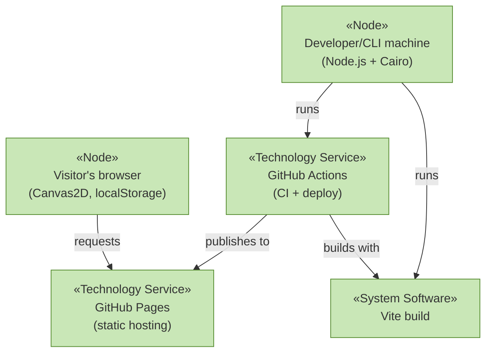

# Technology Layer

_[← EA home](../README.md)_

The runtimes, tooling and infrastructure that the [application
layer](../application/README.md) executes on.

| Document                                           | Elements                                                         |
| -------------------------------------------------- | ---------------------------------------------------------------- |
| [technology-services.md](./technology-services.md) | Technology Services and the nodes/system software providing them |
| [deployment.md](./deployment.md)                   | Nodes, Artifacts, and the CI/CD deployment pipeline              |

## Layer view

