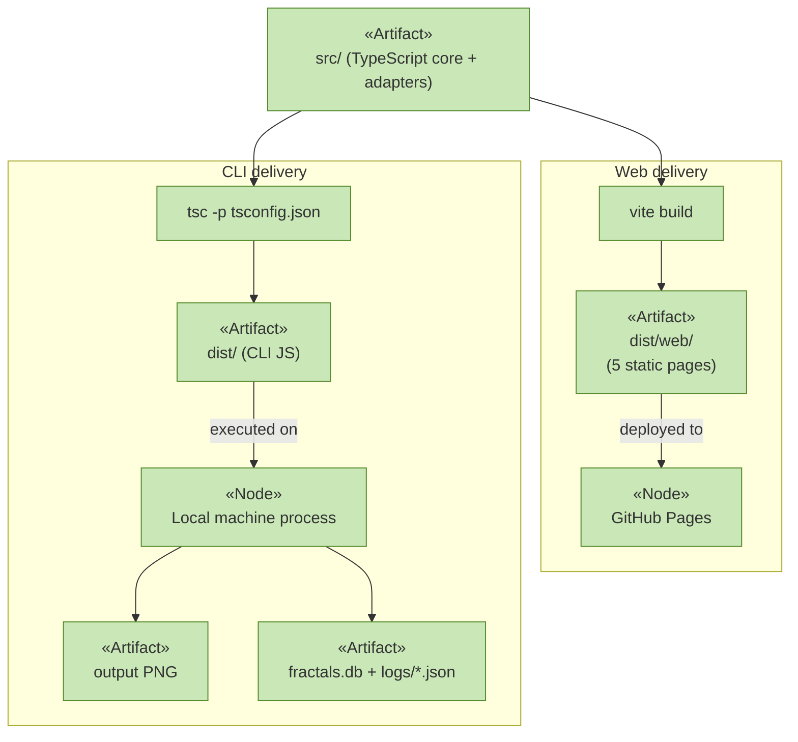
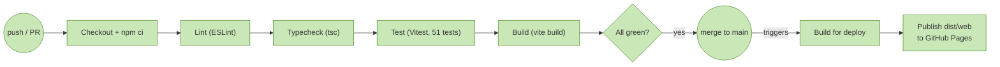

# Deployment

_[← Technology layer](./README.md)_

**ArchiMate elements:** Node, Artifact, Deployment/Communication relationships.

## Nodes and artifacts

| Node                               | Artifacts it hosts                                            | Origin                          |
| ---------------------------------- | ------------------------------------------------------------- | ------------------------------- |
| **Visitor's browser**              | `dist/web/*.html`, JS/CSS bundles, `index.html`…`create.html` | Fetched from GitHub Pages       |
| **GitHub Actions runner (CI)**     | Checked-out repo, `node_modules`, ESLint/TS/Vitest reports    | Ephemeral, per workflow run     |
| **GitHub Actions runner (deploy)** | `dist/web/` build artifact                                    | Produced by `npm run build`     |
| **GitHub Pages**                   | Published `dist/web/`                                         | Deployed by the deploy workflow |
| **Developer / CLI machine**        | Repo checkout, `fractals.db`, `logs/*.json`, generated PNGs   | Local `npm run cli -- generate` |

## Two independent deployables from one build

**Note:** only `FractalService` (the tree) currently runs in the CLI path —
`TurtleFractalService`/`SnowflakeService` are web-only today (see the CLI
parity gap in [project-scope.md](../project-scope.md)); the shared
`IRendererService` port means adding a CLI path is composition-only work.

## CI/CD pipeline

Workflows: `.github/workflows/ci.yml` (gate, every push/PR),
`.github/workflows/deploy.yml` (build + publish, on push to `main`).
One-time setup: repository **Settings → Pages → Source: GitHub Actions**.
No secrets or paid services required — consistent with the zero-cost driver
in [strategy/motivation.md](../strategy/motivation.md).

## Environment requirements

| Environment    | Requirement                                                                              | Why                           |
| -------------- | ---------------------------------------------------------------------------------------- | ----------------------------- |
| Web (browser)  | None beyond a modern browser with Canvas2D                                               | Pure static assets            |
| CLI / CI build | Node.js ≥ 18; Cairo/Pango/libjpeg/libgif/librsvg system libraries (`libcairo2-dev` etc.) | `node-canvas` native bindings |
| Local dev      | `npm install`, `npm run dev` (Vite dev server, port 3000)                                | Hot-reloading iteration       |
