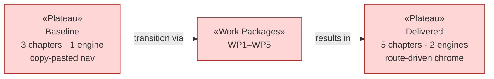

# Project Scope — "From Trees to Your Own Fractals" Initiative

_[← Scope index](./README.md) · [EA home](../ea/README.md)_

**ArchiMate viewpoint:** Implementation & Migration (Work Package, Deliverable,
Plateau, Gap).

This document scopes the delivered initiative — the change set merged from
branch `claude/snowflake-custom-fractals-8nuutc` (PR #5). The strategy and
business context that motivate it are documented separately, top-down, under
[1_strategy/](../ea/1_strategy/README.md).

## Plateaus

| Plateau                | State                                                                                                                                                                                                         |
| ---------------------- | ------------------------------------------------------------------------------------------------------------------------------------------------------------------------------------------------------------- |
| **Baseline** (before)  | A three-chapter journey: Why → How → Tree generator. One fractal engine (`FractalService`, two hardcoded children). Header/nav copy-pasted into each HTML page.                                               |
| **Target** (delivered) | A five-chapter journey adding a snowflake generator and a create-your-own-fractal page. A second, generic turtle engine executes data-driven rules; navigation, badges and pagers render from one route list. |

## Work packages and deliverables

Each work package below was delivered, verified (lint, typecheck, unit tests,
production build, in-browser end-to-end checks) and committed separately.

### WP1 — Route-driven navigation chrome

- **Deliverables:** `src/adapters/web/routes.ts` (single route list),
  `chrome.ts` header/badge/pager renderers, i18n `t(key, params)`
  substitution, `serialRunner.ts` (extracted busy/pending guard), shell-ified
  `index.html` / `learn.html` / `generator.html`.
- **Outcome:** adding a chapter is one route entry; chapter counts update
  automatically.

### WP2 — Turtle engine and formula DSL (core)

- **Deliverables:** `src/core/domain/turtle.ts`,
  `src/core/application/TurtleFractalService.ts`,
  `src/core/application/turtle/formula.ts` (parser, canonical serializer,
  validator, segment estimator), `ITurtleFractalService` port, 29 unit tests.
- **Outcome:** fractal rules become data (up to 5 self-calls), with a hard
  segment budget for safety.

### WP3 — Snowflake page (chapter 4)

- **Deliverables:** `SnowflakeService` (+ `SnowflakeParams` domain type),
  `snowflake.html`, `SnowflakeControls.ts`, widget extraction
  (`controls/widgets.ts`) with `ControlsView` delegation, EN/ES strings,
  3 unit tests (count, 6-fold symmetry, clamping).
- **Outcome:** realistic six-fold dendrite crystals from a simpler panel.

### WP4 — Create-your-own-fractal page (chapter 5)

- **Deliverables:** `create.html`, `create.ts`, `rulebuilder/FormulaBox.ts`,
  `rulebuilder/RuleBuilderView.ts`, six known-fractal presets, live segment
  estimate + trim warning, bilingual notation guide, DSL error messages EN/ES.
- **Outcome:** users author fractal formulas in text or visually, kept in
  two-way sync.

### WP5 — Documentation

- **Deliverables:** README/ARCHITECTURE/CONTRACTS updates and this `docs/ea/`
  enterprise architecture set.

## In scope / out of scope

| In scope                                                   | Out of scope (gaps, candidate future work)                                                |
| ---------------------------------------------------------- | ----------------------------------------------------------------------------------------- |
| Snowflake generator page with realistic defaults           | Row reordering inside the visual rule builder (delete + re-add, or edit the text instead) |
| Turtle formula DSL + parser + visual builder, two-way sync | Turtle/snowflake rendering in the Node CLI (CLI remains tree-only)                        |
| Up to 5 concurrent self-calls per formula                  | Sharing formulas via URL parameters                                                       |
| 5-chapter navigation from a single route list              | Accent-color control on the new pages (tree page keeps its 3rd color)                     |
| EN/ES localization of every new string                     | Additional languages                                                                      |
| Segment budget + estimate safeguards                       | Web workers / off-main-thread rendering for very large programs                           |

## Gap notes

- **CLI parity gap:** `NodeCanvasRendererService` already satisfies the
  renderer port the turtle engine draws through, so adding CLI snowflakes is
  wiring work in `NodeComposition.ts`/`cli.ts`, not engine work.
- **Formula sharing gap:** the canonical serializer
  (`serializeFormula`) makes a `?formula=` URL parameter straightforward if
  prioritized later.
